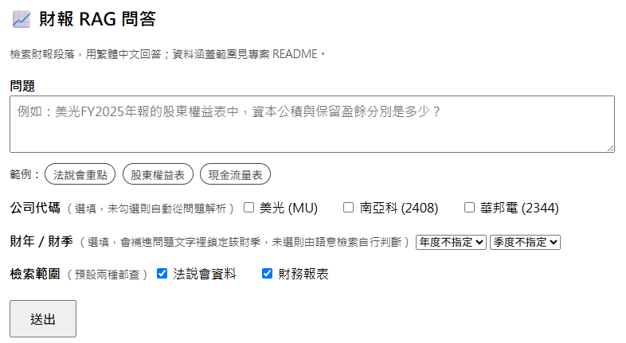
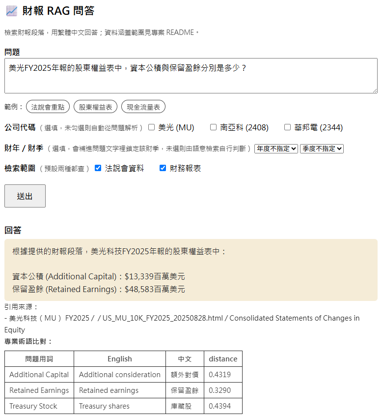
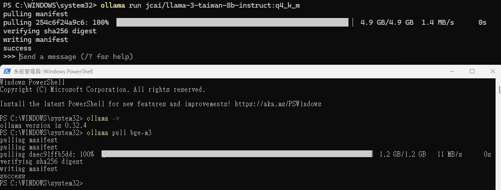
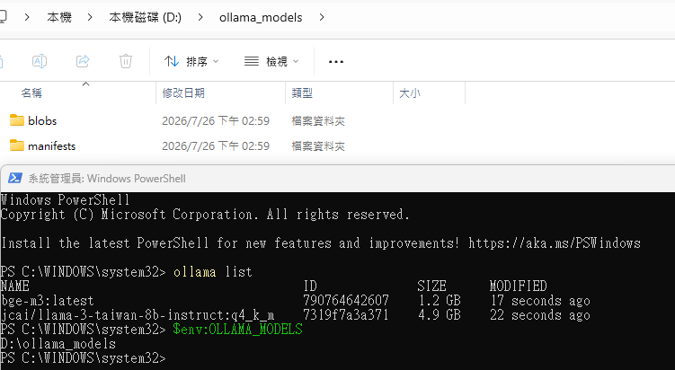
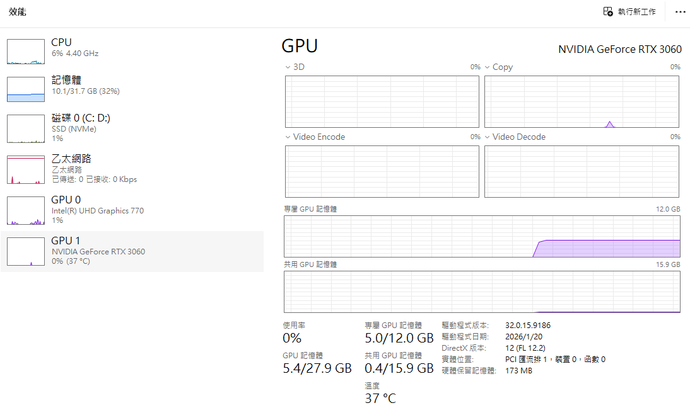
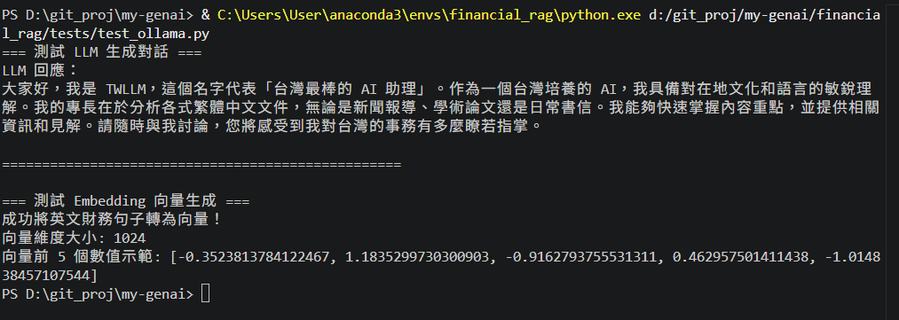

# 📈 英文財報分析 RAG 專案：本地開發與配置指南

本專案旨在建立一個以檢索增強生成（RAG, Retrieval-Augmented Generation）為核心的 AI 系統，能精準讀取並分析英文財務報告，並以流暢的繁體中文回答相關問題。

<details>
<summary>🖼️ 財報 RAG 問答系統 (以 GUI 網頁呈現)</summary>

輸入問題、可選公司代碼／財年財季／檢索範圍：



送出後顯示回答、引用來源與專業術語比對表：



</details>

## 🛠️ 1. 系統硬體與模型配置 (Environment & Models)

- **硬體資源**：Nvidia GPU (12 GB VRAM)
- **模型儲存路徑**：`D:\ollama_models`（透過 Windows 環境變數 `OLLAMA_MODELS` 指定）

| 模型架構類型 | 模型名稱 (Ollama Tag) | 尺寸/量化版本 | 說明/用途 |
| --- | --- | --- | --- |
| LLM (文字生成) | [`cwchang/llama-3-taiwan-8b-instruct:q4_k_m`](https://ollama.com/jcai/llama-3-taiwan-8b-instruct) | ~4.9 GB (4-bit) | 具備台灣在地化語言能力的 LLM，負責將檢索到的財報內容彙總並用繁體中文回答。 |
| Embedding (向量化) | [`bge-m3:latest`](https://ollama.com/library/bge-m3) | ~1.2 GB (567M) | 強大的跨語言語意模型（生成 1024 維度向量），負責將英文財報段落與中文提問進行語意對齊。 |

> 💡 **VRAM 載入注意事項**：Ollama 預設會在閒置 5 分鐘後自動將模型從 VRAM 釋放（卸載至 0.0 GB），發送新請求時會自動重新載入，屬正常的省電與資源釋放機制。若希望模型永久常駐顯存，可在呼叫時帶入 `keep_alive="-1"`。

<details>
<summary>🖼️ 模型下載與 GPU 資源確認</summary>

`ollama pull` 下載 LLM 與 embedding 模型：



確認 `OLLAMA_MODELS` 環境變數指向 `D:\ollama_models`，且 `ollama list` 顯示兩顆模型皆已就緒：



透過工作管理員確認推論時實際使用的是獨立顯卡（NVIDIA GeForce RTX 3060）而非內顯：



</details>

## 🐍 2. 開發環境建置 (Anaconda / Environment Setup)

為避免套件版本衝突並利於未來移轉，本專案採用 Anaconda 進行獨立環境管理。

```bash
# 1. 建立指定 Python 3.11 的獨立環境
conda create -n financial_rag python=3.11 -y

# 2. 啟用環境
conda activate financial_rag

# 3. 安裝專案核心套件
pip install ollama chromadb pdfplumber
```

<details>
<summary>📦 套件選擇：為何 PDF 解析選 pdfplumber 而非 PyMuPDF (fitz)</summary>

| 面向 | pdfplumber [現況] | PyMuPDF (fitz) |
| --- | --- | --- |
| 表格偵測 | 原生 `find_tables()`，已針對本專案財報投影片的誤判情況（裝飾邊框、圖表視覺網格）大量客製化調校 | 也有 `find_tables()`，但策略較新、跟 pdfplumber 不同，需重新驗證 |
| 文字＋座標存取 | object-level 存取（chars/words/rects 皆有精確 bbox），`page.filter()`／`extract_text_lines()` 是為了「排除某區域再取文字」設計的，現有三層擷取邏輯（圖表/表格/純文字）都建立在這個模型上 | `get_text("dict")` 提供類似資訊，但物件模型完全不同（巢狀 blocks/lines/spans vs pdfplumber 的扁平 dict），現有邏輯要整套重寫 |
| 速度 | 純 Python（基於 pdfminer.six），批次處理較慢 | C 底層（MuPDF），明顯更快 |
| 裁圖給 Vision model | `page.crop(bbox).to_image(resolution=...)` 已可直接輸出 `PIL.Image`，依賴為 `pdfminer.six/Pillow/pypdfium2`，**皆為 pip 套件，不需額外系統執行檔** | `page.get_pixmap(clip=fitz.Rect(...))` 同樣方便；兩者 bbox 座標系相容（皆為左上原點的 PDF points），可直接互通不需轉換 |
| 授權 | MIT 系列，寬鬆 | AGPL（商用需買 license） |

當接上 Vision model 時，直接用 pdfplumber 的 `crop().to_image()` 裁圖即可；若日後真的遇到
裁圖品質/速度的具體問題，可考慮只在裁圖這個函式局部引入 PyMuPDF，而非整層替換。

</details>

## 🧪 3. Python API 基礎測試 (Step 2 驗證腳本)

驗證腳本位於 [tests/test_ollama.py](tests/test_ollama.py)，用於驗證 LLM 生成與 Embedding 向量化功能。

執行方式：

```bash
conda activate financial_rag
python tests/test_ollama.py
```

<details>
<summary>🖼️ 執行結果</summary>



</details>

## 🚀 4. 未來部署與架構規劃 (Deployment Roadmap)

```
[開發階段]     Anaconda (financial_rag) + Windows Ollama (GPU 直通)
      │        目前僅有腳本呼叫（scripts/test_rag_chain.py），無對外服務介面
      ▼
[API 階段]     FastAPI 封裝 retriever/generator 為 HTTP 服務
      │        先有可呼叫的服務，才有東西值得裝進容器
      ▼
[部署階段]     Docker Container + Nvidia Container Toolkit (實現開發即部署)
```

- **開發階段（當前）**：使用 Anaconda 虛擬環境開發，依賴已整理成 [requirements.txt](requirements.txt)（只列專案程式碼直接 import 的套件並釘死版本，不用 `pip freeze` 整包匯出，避免把尚未真正使用的套件也一併凍結進去，見套件選型章節）。目前 RAG 鏈路只能透過腳本呼叫，還沒有對外服務介面。
- **API 階段（已完成）**：用 FastAPI 把 `src/rag/retriever.py`／`generator.py` 封裝成 HTTP 端點（`src/api/main.py`），並附上瀏覽器端查詢頁面（`src/api/static/index.html`）方便手動測試，這是比直接上 Docker 更優先的一步——Docker 只負責把「已存在的服務」打包成可攜的部署單位，本身不會憑空產生服務能力；容器化一個沒有對外介面的腳本沒有實質效益。
- **部署階段（下一步）**：等 FastAPI 服務就緒後，採用 Docker + Docker Compose 架構，將 Python 後端（FastAPI）、向量資料庫（如 ChromaDB / Qdrant）與 Ollama 容器化，可快速部署至任何 Linux / 雲端伺服器。

<details>
<summary>✅ RAG 專案部署階段必要流程 (Deployment Checklist)</summary>

部署到新環境（或重建現有環境）時，依序需要完成以下步驟，缺一不可：

1. **安裝依賴**
   ```bash
   pip install -r requirements.txt
   ```

2. **準備 Ollama 模型**：部署環境需要能存取 GPU 的 Ollama 服務，並預先下載本專案用到的兩顆模型（見 §1 模型配置表）：
   ```bash
   ollama pull jcai/llama-3-taiwan-8b-instruct:q4_k_m
   ollama pull bge-m3
   ```
   若磁碟空間規劃在非系統碟，記得設定 `OLLAMA_MODELS` 環境變數指到對應路徑。

3. **持久化儲存掛載**：以下目錄／檔案是狀態資料，容器重啟/重新部署時不能遺失，必須掛載成 volume：
   - `data/raw/`、`data/manifest.json`（原始文件與索引）
   - `data/processed/parsed/`、`data/processed/chunks/`（前處理中繼產物）
   - `data/chroma_db/`（向量資料庫本體）

4. **建立/回填向量資料庫**：兩種方式擇一——
   - **重新跑一次 pipeline**（適合資料有變動時）：`generate_manifest.py` → 對每份新文件跑 `page_filter.py`／`chunker.py` → `ingest_data.py`（詳見 [docs/manifest_schema.md](docs/manifest_schema.md) 的 SOP）
   - **直接帶著現有的 `data/chroma_db/` 一起部署**（適合資料沒變、只是換環境時），省去重新處理耗時的 PDF 解析與 embedding

5. **GPU passthrough**：容器化部署時需要 Nvidia Container Toolkit，讓 Ollama 容器內的 LLM／embedding 推論能存取 GPU，否則會退回 CPU 造成回應時間大幅增加。

6. **部署前健康檢查（smoke test）**：跑 [scripts/test_rag_chain.py](scripts/test_rag_chain.py) 的 golden set，確認 Ollama 模型、ChromaDB 連線、檢索結果都正常，再讓服務正式對外。

</details>

## 📂 5. 資料來源 (Data Sources)

對應 `data/raw/` 目錄結構，整理實際資料的來源連結：

### `data/raw/10K/`（美國股市財報）& `data/raw/TW_AIA` (台灣股市財報)

| 公司 | 說明 | 會計結算日 | 來源連結 |
| --- | --- | --- | --- |
| 美光 (Micron) | SEC 10-K 檔案 (HTML) | 2021-09-02 起算 5 年 | https://investors.micron.com/sec-filings |
| 南亞科 | 公開資訊觀測站 查核報告 (PDF) | 2021-12-31 起算 5 年 | https://mops.twse.com.tw/mops/#/web/t57sb01_q1 <br>(查股票代碼 2408，英文版財報) |
| 華邦電 | 公開資訊觀測站 查核報告 (PDF) | 2021-12-31 起算 5 年 | https://mops.twse.com.tw/mops/#/web/t57sb01_q1 <br>(查股票代碼 2344，英文版財報) |

### `data/raw/investor/`（法說會相關文件）

| 公司 | 說明 | 會計年度 | 來源連結 |
| --- | --- | --- | --- |
| 美光 (Micron) | 法說會相關文件 (PDF) | FY2025Q2 - FY2026Q3  | https://investors.micron.com/events-and-presentations |
| 南亞科 | 法說會相關文件 (PDF) | FY2025Q1 - FY2026Q1 | https://finmoconf.diveinvest.net <br>(查股票代碼 2408，英文簡報) |
| 華邦電 | 法說會相關文件 (PDF) | FY2025Q1 - FY2026Q1 | https://finmoconf.diveinvest.net <br>(查股票代碼 2344，英文簡報) |

### `data/raw/glossary/`（會計用語對照表）

| 文件說明 | 來源連結 |
| --- | --- |
| 財團法人會計研究發展基金會<br>重要會計用語中英對照 | https://www.ardf.org.tw/tifrs2.html |

<details>
<summary>📁 原始資料檔名規範與資料夾結構建議 (Raw Data Naming & Folder Conventions)</summary>

為了讓 `parser/` 與 `ingest_data.py` 之後能直接從路徑/檔名解析出 metadata（公司、文件類型、日期），新增檔案時請依下列規則命名與存放。

### 檔名格式

統一格式：`{market}_{ticker}_{doc_type}_[{FY年}[Q{季}]_]{YYYYMMDD}[_補充說明].{ext}`

| 欄位 | 說明 | 範例 |
| --- | --- | --- |
| `market` | 發行股票市場 | `US`、`TW` |
| `ticker` | 股票代碼（美股用代號，台股用 4 碼數字） | `MU`、`2408`、`2344` |
| `doc_type` | 文件類型（同一份文件若拆成多種形式，直接各自獨立成一個 doc_type，不共用同一個再靠補充說明區分） | `10K`、`AIA`、`investor-conference`、`earning-deck`、`prepared-remarks` |
| `FY年[Q季]` | 選用，標示財年／財季。`annual_report` 類用 `FY{年}`；`quarterly_earningcall` 類用 `FY{年}Q{季}`，且財季歸屬**需人工核對**（法說會日期與其歸屬財季常跨年，如 12 月法說會可能報告的是下一財年 Q1），核對細節見 [docs/manifest_schema.md](docs/manifest_schema.md) | `FY2021`、`FY2026Q3` |
| `YYYYMMDD` | 財報結算日或法說會**實際召開日期**（ISO 格式，不用季度字串） | `20250331` |
| `_補充說明` | 選用，區分同一份文件的不同版本（如修訂版） | `_v2` |

範例：
- `US_MU_10K_FY2021_20210902.html`
- `TW_2408_AIA_FY2021_20211231.pdf`
- `TW_2344_investor-conference_FY2025Q2_20250806.pdf`
- `US_MU_earning-deck_FY2026Q3_20260624.pdf`
- `US_MU_prepared-remarks_FY2026Q3_20260624.pdf`

> ⚠️ 避免使用空白、公司全名、中譯英名（如 `SEC Filing_Micron Technology_...`、`Nanya_...Investor Conference.pdf`）作為檔名，這類命名難以用固定規則解析，且空白檔名在腳本／跨平台處理時容易出錯。

### 資料夾結構建議

在「文件類型」之下，再依「市場前綴 + 公司代碼」分層，避免多家公司檔案混放在同一層：

```
data/raw/
├── annual_report/
│   ├── US_10K/
│   │   └── US_MU/
│   └── TW_AIA/
│       ├── TW_2408/
│       └── TW_2344/
├── quarterly_earningcall/
│   ├── US_earning_call/
│   │   └── US_MU/
│   └── TW_investor_conference/
│       ├── TW_2408/
│       └── TW_2344/
└── glossary/

data/processed/    # 依 pipeline 階段分兩層，各自鏡射 data/raw/ 結構
├── parsed/        # page_filter.py 輸出：過濾過場頁/免責聲明頁後的乾淨文字 + 章節 metadata
│   ├── annual_report/...
│   ├── quarterly_earningcall/...
│   └── glossary/...
└── chunks/        # chunker.py 輸出：合併 manifest metadata 後、可直接餵給 ChromaDB 的 chunk
    ├── annual_report/...
    ├── quarterly_earningcall/...
    └── glossary/...
```

`parsed/` 與 `chunks/` 是兩個獨立的 pipeline 階段產物，各自資料夾結構完全鏡射 `data/raw/`，不與原始檔案混放（詳見 [docs/manifest_schema.md](docs/manifest_schema.md) 的「Pipeline 階段與資料夾」章節）。

`glossary/` 為單一參考文件，不需依公司分層。`data/processed/` 各子資料夾結構與 `data/raw/` 一致，方便 `chunker.py` 輸出對應到同一個檢索模組（collection）。

### 機器可讀的來源清單 (manifest)

本 README 的表格是「給人看」的說明，機器可讀版本為 `data/manifest.json`，由 `scripts/generate_manifest.py` 掃描 `data/raw/` 自動產生，供 `ingest_data.py` 直接讀取寫入向量資料庫的 metadata。欄位規格與待補項目詳見 [docs/manifest_schema.md](docs/manifest_schema.md)。

```bash
python scripts/generate_manifest.py
```

</details>

## 🩺 6. RAG 生成鏈路除錯記錄

`src/rag/` 的檢索/生成鏈路已知限制與修正記錄（表格 colspan/rowspan 解析、取樣溫度、中英術語對應、單位/負數判讀等），見 [docs/rag_generation_notes.md](docs/rag_generation_notes.md)，遇到「明明檢索到資料、LLM 卻答錯或查無資料」時可先查這份文件。

## 📌 當前進度摘要

- [x] Step 1：Ollama 安裝、模型下載（llama-3-taiwan & bge-m3）與 D 槽路徑修正。
- [x] Step 2：Anaconda 獨立環境建置與 `test_ollama.py` 測試腳本準備。
- [x] Step 3：讀取英文財報（PDF 法說會簡報／HTML 10-K）、切塊（Chunking）並存入向量資料庫（`page_filter.py`／`chunker.py`／`annual_report_parser_us10k.py`／`ingest_data.py`）。
- [x] Step 4：檢索鏈路串接（RAG Chain），實現英文檢索與繁體中文回答（`src/rag/retriever.py`／`generator.py`，驗證腳本 [scripts/test_rag_chain.py](scripts/test_rag_chain.py)）。
- [x] Step 5：財會中英術語比對（`glossary_matcher.py`／`glossary_lookup.py`），橋接中文提問與英文財報用語。
- [x] Step 6：FastAPI 封裝 RAG 鏈路為 HTTP 服務，含瀏覽器端查詢頁面與自動化 smoke test（`src/api/main.py`／`src/api/static/index.html`，驗證腳本 [scripts/test_api.py](scripts/test_api.py)）。
- [ ] Step 7：（下一階段）Docker Container 化部署，待 Step 6 的服務介面就緒後才有意義。
- [ ] Step 8：（下一階段，優先度較低）Vision model 串接，讀取圖表內容（目前 `charts` 欄位僅記錄座標，見 `page_filter.py`）。
