# 📈 Financial RAG：英文財報 × 繁體中文問答系統

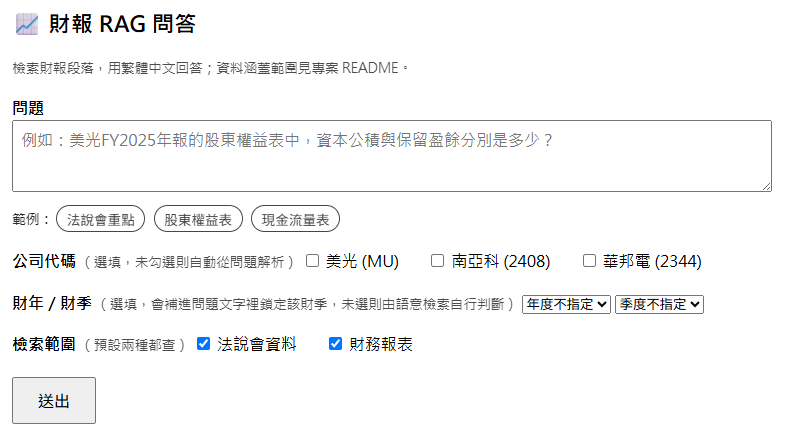

## 1. 專案概述

本專案是一套**完全在本機執行**的檢索增強生成（RAG, Retrieval-Augmented Generation）系統：讀取美股、台股記憶體大廠（美光 Micron、南亞科、華邦電）的**英文**年報與法說會簡報，讓使用者用**繁體中文**提問，系統從財報中檢索相關段落，再由 LLM 依原文生成繁中回答，並附上引用來源與中英專業術語對照。

**做了什麼**

- 解析 PDF 法說會簡報與 SEC 10-K HTML 年報，處理表格、圖表區域、頁尾雜訊、多層表頭等版面問題
- 依「公司／財年／財季／報表」metadata 建立 3 個 ChromaDB collection，支援語意檢索 + 結構化過濾
- 用財會、半導體中英詞彙表橋接「中文提問 ↔ 英文表格欄名」
- 以 FastAPI 封裝成 HTTP 服務並附瀏覽器查詢頁面，最後用 Docker 容器化部署

**主要技術**

| 類別 | 技術 |
| --- | --- |
| LLM（生成） | Ollama + `llama-3-taiwan-8b-instruct`（4-bit 量化） |
| Embedding（向量化） | Ollama + `bge-m3`（跨語言，1024 維） |
| 向量資料庫 | ChromaDB（`PersistentClient` 內嵌式） |
| 文件解析 | pdfplumber（PDF）、BeautifulSoup（10-K HTML） |
| 服務與部署 | FastAPI、Uvicorn、Docker / Docker Compose |
| 開發環境 | Python 3.11、Anaconda、NVIDIA RTX 3060（12 GB VRAM） |

## 2. 問題與動機

想比較美光、南亞科、華邦電的營運狀況時，原始資料有幾個痛點：

- **語言門檻**：財報與法說會簡報都是英文，且充滿財會專業術語；同一個概念，中文慣用語（「資本公積」「保留盈餘」）跟英文欄名（"Additional Capital"、"Retained Earnings"）字面上完全不同，查找時很容易對不上。
- **資料分散、格式不一**：美股 10-K 是 SEC 的 HTML，台股是公開資訊觀測站的 PDF，法說會則是各家格式各異的投影片；投影片充滿裝飾邊框、圖表、免責聲明頁，難以直接複製取用。
- **跨市場比較容易出錯**：美股與台股財年命名會差一季（例如美光 FY2026Q2 對應南亞科 FY2026Q1），幣別也不同，人工對照時容易拿錯期別比較。
- **通用 LLM 不可靠**：直接問 ChatGPT 類工具，容易得到記憶中過時或編造的數字，也無法指出出處；財報資料又不適合任意上傳到外部服務。

因此目標是做一個**能指出資料出處、只根據財報原文作答、可在本機離線執行**的中文財報問答工具。

## 3. 解決方案

採用 RAG 架構，讓 LLM 只負責「讀已檢索到的原文並用中文表達」，不依賴模型本身記憶的知識：

1. **離線前處理**：解析原始財報 → 清除雜訊頁與頁尾 → 依頁（法說會）或依報表（10-K）切成 chunk → 附上公司／財年／財季／報表等 metadata → 以 `bge-m3` 向量化後存入 ChromaDB。
2. **跨語言語意檢索**：`bge-m3` 讓中文提問可以直接檢索英文段落；再依問題中的公司名稱、財季（`FY2026Q3`）、財年、報表名稱、「最新」等關鍵字，用 metadata 先縮小範圍，避免語意相近但期別錯誤的段落混入。
3. **術語橋接**：生成前先用 LLM 抓出候選專業術語，再對詞彙表 collection 做語意比對，把官方中英對照當作「提示」餵給 LLM。
4. **受限生成**：System prompt 限定只能依段落作答、找不到就說查無資料、不可自行編造匯率、必須保留單位與負號；`temperature=0` 讓結果可重現。
5. **引用來源由系統產生**：引用清單直接從檢索結果的 metadata 組出，不交給 LLM 抄寫，避免漏引或編造頁碼。

## 4. 系統架構 / Workflow

### 4-1. 資料前處理（Ingestion Pipeline）

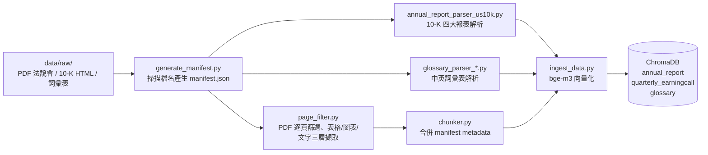
```mermaid
flowchart LR
    A["data/raw/<br>PDF 法說會 / 10-K HTML / 詞彙表"] --> B["generate_manifest.py<br>掃描檔名產生 manifest.json"]
    B --> C1["page_filter.py<br>PDF 逐頁篩選、表格/圖表/文字三層擷取"]
    B --> C2["annual_report_parser_us10k.py<br>10-K 四大報表解析"]
    B --> C3["glossary_parser_*.py<br>中英詞彙表解析"]
    C1 --> D["chunker.py<br>合併 manifest metadata"]
    C2 --> E
    C3 --> E
    D --> E["ingest_data.py<br>bge-m3 向量化"]
    E --> F[("ChromaDB<br>annual_report<br>quarterly_earningcall<br>glossary")]
```

### 4-2. 查詢流程（Query Flow）

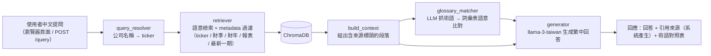
```mermaid
flowchart LR
    Q["使用者中文提問<br>（瀏覽器頁面 / POST /query）"] --> R["query_resolver<br>公司名稱 → ticker"]
    R --> S["retriever<br>語意檢索 + metadata 過濾<br>（ticker / 財季 / 財年 / 報表 / 最新一期）"]
    S --> DB[("ChromaDB")]
    DB --> C["build_context<br>組出含來源標頭的段落"]
    C --> G1["glossary_matcher<br>LLM 抓術語 → 詞彙表語意比對"]
    G1 --> G2["generator<br>llama-3-taiwan 生成繁中回答"]
    C --> G2
    G2 --> O["回應：回答 + 引用來源（系統產生）+ 術語對照表"]
```

### 4-3. 部署架構

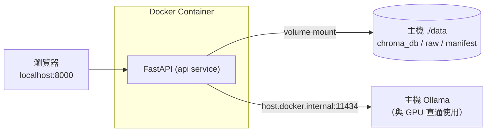
```mermaid
flowchart LR
    U["瀏覽器<br>localhost:8000"] --> API
    subgraph Docker["Docker Container"]
        API["FastAPI (api service)"]
    end
    API -- "volume mount" --> D[("主機 ./data<br>chroma_db / raw / manifest")]
    API -- "host.docker.internal:11434" --> OL["主機 Ollama<br>（與 GPU 直通使用）"]
```

Ollama 不放進容器：模型檔大且需要與 GPU 直通使用，沿用主機已下載的模型即可；ChromaDB 是內嵌式，不需要獨立資料庫容器，只要把 `data/` 掛成 volume。

## 5. 技術實作

### 5-1. 專案結構

```
src/
├── parser/      # page_filter.py（PDF）、annual_report_parser_us10k.py（10-K）、chunker.py、glossary_parser_*.py
├── database/    # chroma_client.py：PersistentClient、bge-m3 embedding、upsert
├── rag/         # query_resolver.py、retriever.py、glossary_matcher.py、generator.py
└── api/         # main.py（FastAPI）、static/index.html（查詢頁面）
scripts/         # generate_manifest.py、ingest_data.py、test_rag_chain.py（golden set）、test_api.py（smoke test）
docs/            # manifest_schema.md、rag_generation_notes.md
```

### 5-2. 核心實作細節

- **PDF 三層擷取**（`page_filter.py`）：先用 `find_tables()` 找表格，並用面積比例、欄列數、儲存格填充率篩掉「長條圖格線被誤判成表格」的假表格；再框出圖表區域（內容圖片 + 假表格 bbox + 鄰近座標軸線條），區域內文字不讀入、留待 Vision model；最後排除前兩層後剩下的才是正文。另外依公司分派章節偵測策略（章節分隔頁 vs. 每頁大標題）與頁尾規則，連美光模板疊字造成的亂碼日期頁尾（如 `JJuunnee 2244,, 22002266`）也一併移除。
- **10-K 表格解析**（`annual_report_parser_us10k.py`）：依 `colspan`/`rowspan` 展開成完整網格後再收斂重複副本；自動判斷多層表頭深度；擷取 `(In millions…)` 單位說明併入表格標題。
- **Chunk 與 metadata**（`chunker.py`）：MVP 階段一頁（或一張報表）一個 chunk，表格以 Markdown 接在正文後；manifest 的文件層級欄位（市場、ticker、財年、財季、結算日、法說會日期…）展平進每個 chunk，作為檢索過濾條件。
- **檢索**（`retriever.py`）：每個 collection × 每家公司各自取 top-k 再合併，避免某家公司的段落把其他公司擠掉；依問題內容動態組 `where` 條件（指定財季／財年、指定報表、「最新」一期依 `event_date` 或 `fiscal_period_end` 取最大值）。
- **生成**（`generator.py`）：System prompt 明訂跨市場財季對齊規則、無匯率不得換算、保留單位、括號代表負數；`temperature=0`；檢索不到段落時直接回固定訊息，不呼叫 LLM。
- **API**（`src/api/main.py`）：`GET /health` 檢查三個 collection；`POST /query` 跑完整流程；無效 collection 名稱回 400 而非通用 500；靜態頁面掛在所有路由之後，避免蓋掉 API 路徑。

### 5-3. 模型配置

- **硬體資源**：NVIDIA GPU（12 GB VRAM）
- **模型儲存路徑**：`D:\ollama_models`（透過 Windows 環境變數 `OLLAMA_MODELS` 指定）

| 模型架構類型 | 模型名稱 (Ollama Tag) | 尺寸/量化版本 | 說明/用途 |
| --- | --- | --- | --- |
| LLM<br>(文字生成) | [`cwchang/llama-3-taiwan-8b-instruct:q4_k_m`](https://ollama.com/jcai/llama-3-taiwan-8b-instruct) | ~4.9 GB (4-bit) | 具備台灣在地化語言能力的 LLM，負責將檢索到的財報內容彙總並用繁體中文回答。<br>⚠️ 實作限制：量化 8B 模型讀表格跨欄比對本身不穩定，已用 `temperature=0` 消除隨機亂答，但無法提升正確率上限；要求「加總/比較」多個數字時常拒答或給出不合理推論。 |
| Embedding<br>(向量化) | [`bge-m3:latest`](https://ollama.com/library/bge-m3) | ~1.2 GB (567M) | 強大的跨語言語意模型（生成 1024 維度向量），負責將英文財報段落與中文提問進行語意對齊。<br>⚠️ 實作限制：語意檢索不保證命中最精確的官方譯名，glossary 比對結果只能當提示，不能完全取代模型判斷。 |

> 💡 **VRAM 載入注意事項**：Ollama 預設閒置 5 分鐘後會把模型從 VRAM 卸載，下次請求時自動重新載入（第一次回應會多等幾秒，屬正常現象）。本專案的 LLM 呼叫（`generator.py`、`glossary_matcher.py`）設定 `keep_alive="10s"`，閒置 10 秒就釋放顯存，讓 GPU 平常不被佔用；代價是兩次查詢間隔超過 10 秒時，下一次會有冷啟動延遲。bge-m3 由 ChromaDB 呼叫，未另外設定，沿用預設 5 分鐘。若希望模型常駐顯存，可改成 `keep_alive=-1`（數字，不是字串）。

<details>
<summary>🖼️ 模型下載與 GPU 資源確認</summary>

`ollama pull` 下載 LLM 與 embedding 模型：

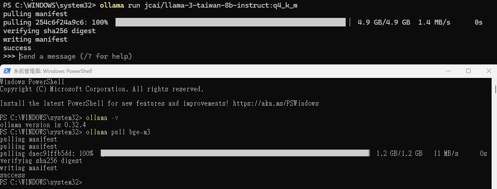

確認 `OLLAMA_MODELS` 環境變數指向 `D:\ollama_models`，且 `ollama list` 顯示兩顆模型皆已就緒：

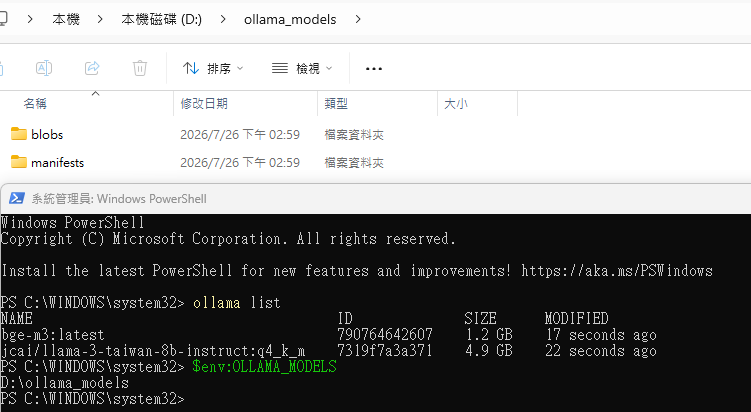

透過工作管理員確認推論時實際使用的是獨立顯卡（NVIDIA GeForce RTX 3060）而非內顯：

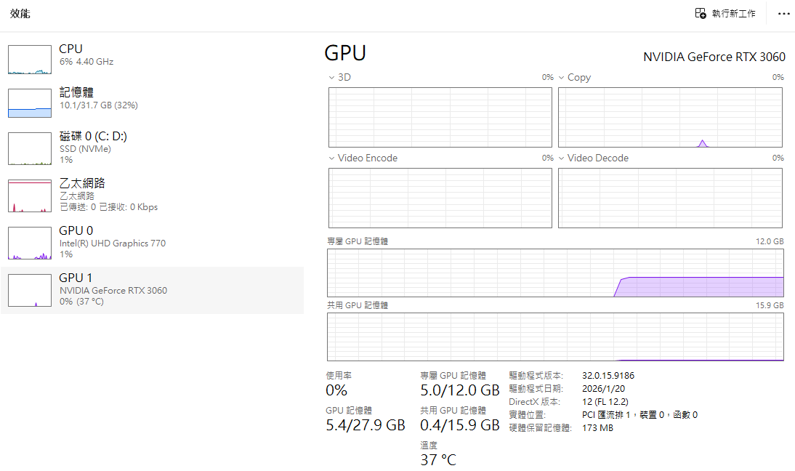

</details>

<details>
<summary>📦 套件選擇：為何 PDF 解析選 pdfplumber 而非 PyMuPDF (fitz)</summary>

| 面向 | pdfplumber [現況] | PyMuPDF (fitz) |
| --- | --- | --- |
| 表格偵測 | 原生 `find_tables()`，已針對本專案財報投影片的誤判情況（裝飾邊框、圖表視覺網格）大量客製化調校 | 也有 `find_tables()`，但策略較新、跟 pdfplumber 不同，需重新驗證 |
| 文字＋座標存取 | object-level 存取（chars/words/rects 皆有精確 bbox），`page.filter()`／`extract_text_lines()` 是為了「排除某區域再取文字」設計的，現有三層擷取邏輯（圖表/表格/純文字）都建立在這個模型上 | `get_text("dict")` 提供類似資訊，但物件模型完全不同（巢狀 blocks/lines/spans vs pdfplumber 的扁平 dict），現有邏輯要整套重寫 |
| 速度 | 純 Python（基於 pdfminer.six），批次處理較慢 | C 底層（MuPDF），明顯更快 |
| 裁圖給 Vision model | `page.crop(bbox).to_image(resolution=...)` 已可直接輸出 `PIL.Image`，依賴為 `pdfminer.six/Pillow/pypdfium2`，**皆為 pip 套件，不需額外系統執行檔** | `page.get_pixmap(clip=fitz.Rect(...))` 同樣方便；兩者 bbox 座標系相容（皆為左上原點的 PDF points），可直接互通不需轉換 |
| 授權 | MIT 系列，寬鬆 | AGPL（商用需買 license） |

當接上 Vision model 時，直接用 pdfplumber 的 `crop().to_image()` 裁圖即可；若日後真的遇到
裁圖品質/速度的具體問題，可考慮只在裁圖這個函式局部引入 PyMuPDF，而非整層替換。

</details>

### 5-4. 資料來源

對應 `data/raw/` 目錄結構，整理實際資料的來源連結（`data/` 不進 git，需自行放置）：

**年報：`data/raw/annual_report/`**

| 公司 | 說明 | 會計結算日 | 來源連結 |
| --- | --- | --- | --- |
| 美光 (Micron) | SEC 10-K 檔案 (HTML) | 2021-09-02 起算 5 年 | https://investors.micron.com/sec-filings |
| 南亞科 | 公開資訊觀測站 查核報告 (PDF) | 2021-12-31 起算 5 年 | https://mops.twse.com.tw/mops/#/web/t57sb01_q1 <br>(查股票代碼 2408，英文版財報) |
| 華邦電 | 公開資訊觀測站 查核報告 (PDF) | 2021-12-31 起算 5 年 | https://mops.twse.com.tw/mops/#/web/t57sb01_q1 <br>(查股票代碼 2344，英文版財報) |

> ⚠️ MVP 階段為簡化 chunking 作業，南亞科、華邦電的年報僅存放於 `data/raw/`、已列入 `manifest.json`，但尚未實際跑 `ingest_data.py` 寫入向量資料庫，目前年報檢索/問答涵蓋範圍僅限美光 (MU)。
>
> 美光 10-K 也只解析並存入四大財務報表（資產負債表、綜合損益表、現金流量表、股東權益變動表，見 `annual_report_parser_us10k.py` 的 `STATEMENTS`），10-K 其餘章節（如 MD&A、風險因子、附註）目前直接捨棄、未進向量資料庫。

**法說會：`data/raw/quarterly_earningcall/`**

| 公司 | 說明 | 會計年度 | 來源連結 |
| --- | --- | --- | --- |
| 美光 (Micron) | 法說會相關文件 (PDF) | FY2025Q2 - FY2026Q3  | https://investors.micron.com/events-and-presentations |
| 南亞科 | 法說會相關文件 (PDF) | FY2025Q1 - FY2026Q1 | https://finmoconf.diveinvest.net <br>(查股票代碼 2408，英文簡報) |
| 華邦電 | 法說會相關文件 (PDF) | FY2025Q1 - FY2026Q1 | https://finmoconf.diveinvest.net <br>(查股票代碼 2344，英文簡報) |

> 法說會文件的每一頁都會納入向量資料庫（封面頁、免責聲明頁、過場頁除外）。

**專業用語對照表：`data/raw/glossary/`**

| 文件說明 | 原始格式 | 來源連結 |
| --- | --- | --- |
| 財團法人會計研究發展基金會<br>重要會計用語中英對照 | PDF | https://www.ardf.org.tw/tifrs2.html |
| Uedu 優學院<br>半導體產業專有名詞中英對照 | Markdown（透過 Claude Code 先手動轉網頁資訊） | https://uedu.tw/semiconductor/glossary |

> 性質類似字典檔，或是俗稱的中英對照表；每份只保留最新版本。用途：橋接中文提問用語與英文財報欄名，提升回答準確率。

<details>
<summary>📁 原始資料檔名規範與資料夾結構 (Raw Data Naming & Folder Conventions)</summary>

為了讓 `parser/` 與 `ingest_data.py` 之後能直接從路徑/檔名解析出 metadata（公司、文件類型、日期），新增檔案時請依下列規則命名與存放。

#### 檔名格式

統一格式：`{market}_{ticker}_{doc_type}_[{FY年}[Q{季}]_]{YYYYMMDD}[_補充說明].{ext}`

| 欄位 | 說明 | 範例 |
| --- | --- | --- |
| `market` | 發行股票市場 | `US`、`TW` |
| `ticker` | 股票代碼（美股用代號，台股用 4 碼數字） | `MU`、`2408`、`2344` |
| `doc_type` | 文件類型（同一份文件若拆成多種形式，直接各自獨立成一個 doc_type，不共用同一個再靠補充說明區分） | `10K`、`AIA`、`investor-conference`、`earning-deck`、`prepared-remarks` |
| `FY年[Q季]` | 選用，標示財年／財季。`annual_report` 類用 `FY{年}`；`quarterly_earningcall` 類用 `FY{年}Q{季}`，且財季歸屬**需人工核對**（法說會日期與其歸屬財季常跨年，如 12 月法說會可能報告的是下一財年 Q1），核對細節見 [docs/manifest_schema.md](docs/manifest_schema.md) | `FY2021`、`FY2026Q3` |
| `YYYYMMDD` | 財報結算日或法說會**實際召開日期**（ISO 格式，不用季度字串） | `20250331` |
| `_補充說明` | 選用，區分同一份文件的不同版本（如修訂版） | `_v2` |

範例：
- `US_MU_10K_FY2021_20210902.html`
- `TW_2408_AIA_FY2021_20211231.pdf`
- `TW_2344_investor-conference_FY2025Q2_20250806.pdf`
- `US_MU_earning-deck_FY2026Q3_20260624.pdf`
- `US_MU_prepared-remarks_FY2026Q3_20260624.pdf`

> ⚠️ 避免使用空白、公司全名、中譯英名（如 `SEC Filing_Micron Technology_...`、`Nanya_...Investor Conference.pdf`）作為檔名，這類命名難以用固定規則解析，且空白檔名在腳本／跨平台處理時容易出錯。

#### 資料夾結構

在「文件類型」之下，再依「市場前綴 + 公司代碼」分層，避免多家公司檔案混放在同一層：

```
data/raw/
├── annual_report/
│   ├── US_10K/
│   │   └── US_MU/
│   └── TW_AIA/
│       ├── TW_2408/
│       └── TW_2344/
├── quarterly_earningcall/
│   ├── US_earning_call/
│   │   └── US_MU/
│   └── TW_investor_conference/
│       ├── TW_2408/
│       └── TW_2344/
└── glossary/

data/processed/    # 依 pipeline 階段分兩層，各自鏡射 data/raw/ 結構
├── parsed/        # page_filter.py 輸出：過濾過場頁/免責聲明頁後的乾淨文字 + 章節 metadata
│   ├── annual_report/...
│   ├── quarterly_earningcall/...
│   └── glossary/...
└── chunks/        # chunker.py 輸出：合併 manifest metadata 後、可直接餵給 ChromaDB 的 chunk
    ├── annual_report/...
    ├── quarterly_earningcall/...
    └── glossary/...
```

`parsed/` 與 `chunks/` 是兩個獨立的 pipeline 階段產物，各自資料夾結構完全鏡射 `data/raw/`，不與原始檔案混放（詳見 [docs/manifest_schema.md](docs/manifest_schema.md) 的「Pipeline 階段與資料夾」章節）。`glossary/` 為單一參考文件，不需依公司分層。

#### 機器可讀的來源清單 (manifest)

本 README 的表格是「給人看」的說明，機器可讀版本為 `data/manifest.json`，由 `scripts/generate_manifest.py` 掃描 `data/raw/` 自動產生，供 `ingest_data.py` 直接讀取寫入向量資料庫的 metadata。欄位規格與待補項目詳見 [docs/manifest_schema.md](docs/manifest_schema.md)。

```bash
python scripts/generate_manifest.py
```

</details>

### 5-5. 快速開始

**本機開發（Anaconda）**

```bash
# 1. 建立並啟用 Python 3.11 獨立環境
conda create -n financial_rag python=3.11 -y
conda activate financial_rag

# 2. 安裝依賴（只列專案直接 import 的套件並釘死版本）
pip install -r requirements.txt

# 3. 驗證 Ollama LLM 與 embedding 可正常呼叫
python tests/test_ollama.py

# 4. 啟動 API 與查詢頁面：http://127.0.0.1:8000/（Swagger UI 在 /docs）
uvicorn src.api.main:app --reload --port 8000
```

<details>
<summary>🖼️ test_ollama.py 執行結果</summary>

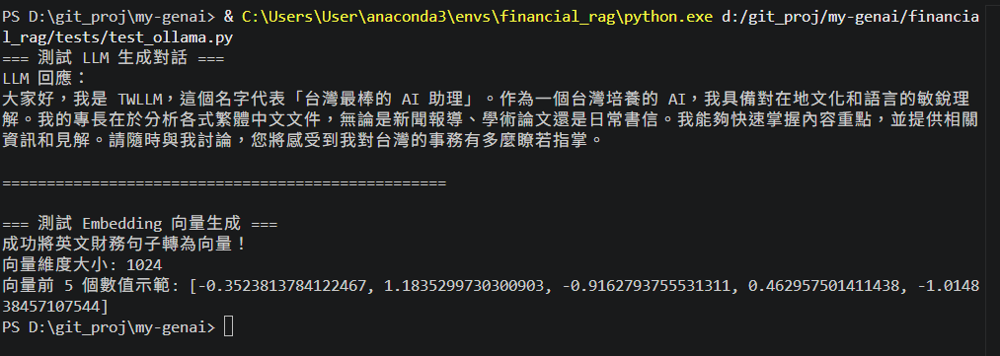

</details>

**Docker 部署**（細部說明見 [README_docker.md](README_docker.md)）

```bash
# 0. 確認主機 Ollama 服務已啟動，且已下載兩顆模型
ollama pull jcai/llama-3-taiwan-8b-instruct:q4_k_m
ollama pull bge-m3

# 1. 建置映像並啟動 api service（容器透過 host.docker.internal 連到主機的 Ollama）
docker compose up -d --build

# 2. 若沒有現成的 data/chroma_db/，在容器內建立向量資料庫（data/raw、data/manifest.json 需先備妥）
docker compose exec api python scripts/ingest_data.py

# 3. 驗證：自動化 smoke test（/health → /query 完整流程）
docker compose exec api python scripts/test_api.py
```

GPU 加速：推論透過主機的 Ollama 進行，GPU 直通沿用主機既有設定即可，不需要在容器內另外設定 Nvidia Container Toolkit；沒有 GPU 時，主機端 Ollama 會退回 CPU 推論，回應時間會明顯變長。

<details>
<summary>✅ 部署階段必要流程 (Deployment Checklist)</summary>

部署到新環境（或重建現有環境）時，依序需要完成以下步驟，缺一不可：

1. **安裝依賴**：`pip install -r requirements.txt`（Docker 部署時由 Dockerfile 處理）
2. **準備 Ollama 模型**：Ollama 跑在主機（不在容器裡），需常駐執行並預先 `ollama pull` 兩顆模型；若磁碟空間規劃在非系統碟，記得設定 `OLLAMA_MODELS` 環境變數。
3. **持久化儲存掛載**：以下目錄／檔案是狀態資料，容器重建時不能遺失，必須掛載成 volume：
   - `data/raw/`、`data/manifest.json`（原始文件與索引）
   - `data/processed/parsed/`、`data/processed/chunks/`（前處理中繼產物）
   - `data/chroma_db/`（向量資料庫本體）
4. **建立/回填向量資料庫**：兩種方式擇一——
   - **重新跑一次 pipeline**（適合資料有變動時）：`generate_manifest.py` → 對每份新文件跑 `page_filter.py`／`chunker.py` → `ingest_data.py`（詳見 [docs/manifest_schema.md](docs/manifest_schema.md) 的 SOP）
   - **直接帶著現有的 `data/chroma_db/` 一起部署**（適合資料沒變、只是換環境時），省去耗時的 PDF 解析與 embedding
5. **GPU 存取**：只要主機端 Ollama 能正常存取 GPU 即可。
6. **部署前健康檢查（smoke test）**：跑 [scripts/test_rag_chain.py](scripts/test_rag_chain.py) 的 golden set 與 [scripts/test_api.py](scripts/test_api.py)，確認 Ollama 模型、ChromaDB 連線、檢索結果都正常，再讓服務正式對外。

</details>

## 6. 成果展示

### 6-1. 問答介面

輸入問題、可選公司代碼／財年財季／檢索範圍之後，送出後顯示 LLM 回答、引用來源與專業術語比對表：

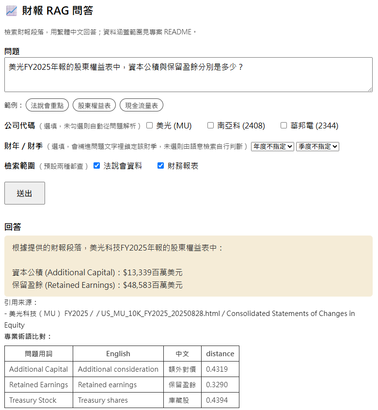

### 6-2. 量化成果

| 指標 | 數值 |
| --- | --- |
| 涵蓋公司 | 3 家（美光、南亞科、華邦電），橫跨美股 / 台股 |
| 已寫入向量資料庫的文件 | 25 份（法說會 18 份、10-K 5 個財年、詞彙表 2 份） |
| 向量資料庫 chunk 總數 | 2,476 筆（`quarterly_earningcall` 454、`annual_report` 20、`glossary` 2,002） |
| Golden set 驗證題 | 7 題，涵蓋單一公司細節、多公司比較、跨市場財季對齊、「最近一季」時間模糊、年報表格、資料庫未涵蓋公司（應拒答）、跨 collection 比較 |
| 年報表格數字正確性 | 修正表格解析後，美光 FY2025 股東權益表的資本公積 / 保留盈餘（$13,339M / $48,583M）與人工核對答案完全一致；FY2021–FY2025 五個財年表頭與資料欄數全部對齊 |
| 回答可重現性 | `temperature=0` 後，同一問題重跑結果一致（修正前同一 context 重跑 3 次會時對時錯） |

> 目前 golden set 為人工核對，尚未做自動化評分（見 §8）。

### 6-3. 向量資料庫與 Docker 部署

ChromaDB 落地結構：每個 collection 各自一個 UUID 資料夾（HNSW 向量索引），`chroma.sqlite3` 為 metadata/索引本體：

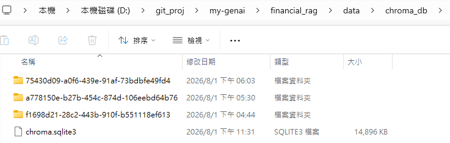

<details>
<summary>🐳 Docker 部署驗證截圖</summary>

`docker compose ps` / `logs` 顯示容器已啟動並處理過查詢：

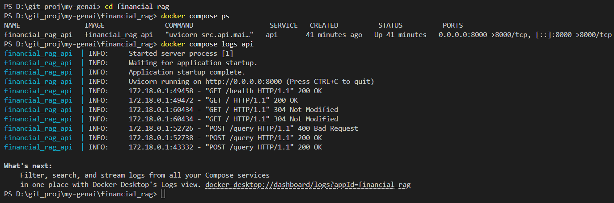

`curl /health` 回應 200 OK 與三個 collection：

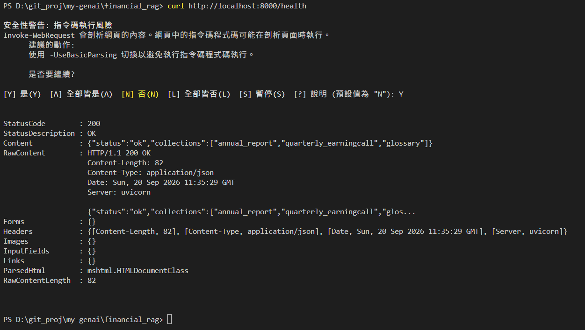

容器化後透過查詢頁面手動送出問題，回答與引用來源正常：

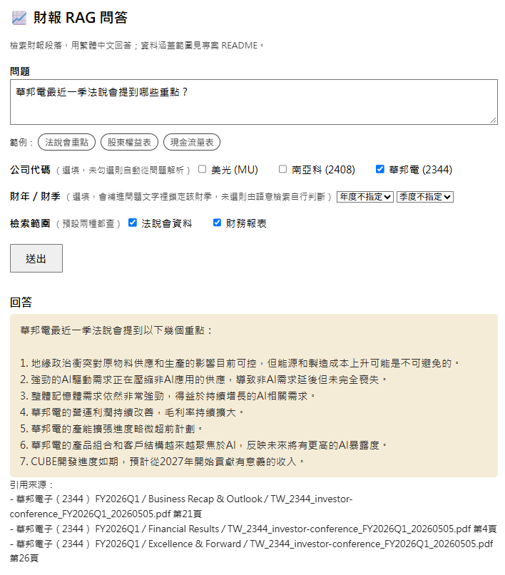

</details>

## 7. 問題與解決方式

完整除錯過程見 [docs/rag_generation_notes.md](docs/rag_generation_notes.md)；遇到「明明檢索到資料、LLM 卻答錯或查無資料」時可先查這份文件。

| # | 問題（症狀） | 根因分析 | 解決方式 |
| --- | --- | --- | --- |
| 1 | 問美光 FY2025 股東權益表，檢索到正確 chunk，LLM 卻回答查無資料 | 10-K 權益變動表使用多層表頭（`colspan`/`rowspan`），parser 逐格取文字沒有展開，表頭欄數與資料列對不上，餵給 LLM 的 Markdown 表格欄位錯位 | 先展開成完整網格，再以「是否同一個原始 `<td>`」收斂重複副本（而非比對文字，避免兩欄剛好同值被誤併）；表頭深度改用「第 0 欄為空」的結構規律自動判斷，不再寫死兩層 |
| 2 | LLM 數字讀對但漏掉單位（$13,339M 說成「13,339」） | 「(In millions…)」單位說明在表格外的獨立文字，parser 只抓 `<table>` 而丟掉 | 以正則擷取單位說明併入表格標題，並在 system prompt 加上「必須保留單位」規則作雙重保險 |
| 3 | 同樣的檢索結果與問題，重跑時有時答對、有時查無資料 | 沒有指定 `temperature`，隨機取樣放大了量化 8B 模型讀表格的不穩定 | 改用 `temperature=0`（greedy decoding）。這只消除隨機性，不會提升模型能力上限；若仍穩定答錯，代表需要換模型或改善 context 呈現 |
| 4 | 中文問「資本公積」答不出，改用英文 "Additional Capital" 就答對 | 卡在中英術語對應；術語比對原本只在生成**之後**執行、僅供人工核對，LLM 根本沒看到 | 改為生成**之前**先比對，把結果以「僅供參考、非文件內容」的提示區塊注入 prompt |
| 5 | 問「華邦電最近一季」卻抓到較舊的季度 | 語意檢索不理解「最近/最新」等時間詞；且最初只查 `event_date`，年報沒有這個欄位，導致年報的「最新」提問退回純語意排序 | 偵測時間關鍵字後改用 metadata 先鎖定最新一期，依序檢查 `event_date`、`fiscal_period_end` 取最大值 |
| 6 | 多公司、多財季比較題，LLM 因 context 期別對不上而保守拒答 | 問題同時出現多個財季字樣，語意排序抓到語意相近但期別錯誤的段落；某家公司段落相似度高時還會把別家擠掉 | 正則解析問題中的 `FYxxxxQx` / `FYxxxx` / 報表名稱轉成 metadata 過濾；每家公司、每個 collection 各自取 top-k 再合併 |
| 7 | 回答中的引用來源漏引或頁碼錯誤；10-K 四張報表只顯示一筆引用 | LLM 對「照格式抄寫引用」指令的遵從度不穩定；去重 key 用 `(source_id, page)`，10-K chunk 沒有頁碼而被誤判為同一筆 | 引用改由程式依檢索結果 metadata 產生；去重改用 chunk 自身唯一 id |
| 8 | 法說會投影片的長條圖被當成表格、文字中混入座標軸刻度 | 圖表的柱狀邊框與格線剛好對齊成網格，被 `find_tables()` 誤判 | 以面積比例、欄列數、儲存格填充率篩掉假表格，並把其 bbox 反過來當作圖表區域，區域內文字不讀入 |

⚠️ **仍未解決的限制**：要求模型對多個數字做加總或比較時，量化 8B 模型常拒答或推論不合理（例如「已經是負值所以無法加總」），這是模型多步驟數學能力的限制，prompt 調整幫助有限。

## 8. 學習與未來改進

### 8-1. 學到的事

- **RAG 的瓶頸多半在資料，不在模型**：多數「LLM 答錯」追到最後是表格解析錯位、單位被丟掉、檢索抓錯期別；先確認 context 本身正確，再討論 prompt 或模型。
- **能用程式確定的事，就不要交給 LLM**：引用來源、財季過濾、「最新一期」判斷都改由程式處理後，結果穩定許多；LLM 只負責理解與表達。
- **除錯要先切分層次**：把問題拆成「檢索有沒有抓對」與「生成有沒有讀對」，再用中英文問法對照等方式驗證假設，比直接改 prompt 有效。
- **服務化再容器化**：先用 FastAPI 做出可呼叫的服務，Docker 才有東西可打包；模型推論服務常駐主機、應用服務容器化，是兼顧 GPU 與可攜性的實務做法。

### 8-2. 目前不完整的地方

- 南亞科、華邦電年報尚未寫入向量資料庫；美光 10-K 只收四大報表，MD&A、風險因子、附註都還沒納入（因此「法說會展望 vs. 年報風險因子」這類題目目前答不完整）。
- Chunking 仍是 MVP（一頁／一張報表一個 chunk）；目前投影片頁面都很短，影響不大，但納入講稿、10-K 文字章節時需要再細切。
- Golden set 仍靠人工核對，沒有自動化評估指標。
- 跨表判讀財務指標，數字加總/比較的正確率受限於量化 8B 模型。

### 8-3. 下一步

- 串接 Vision model 判讀圖表（`page_filter.py` 已保留圖表 bbox，可直接用 `crop().to_image()` 裁圖）
- 完成台股年報解析與 ingest，並納入 10-K 其他章節
- 將數值運算移出 LLM：程式先算好加總、成長率、幣別換算，再交給 LLM 覆述
- 建立自動化評估（檢索命中率、答案與 expected 比對），讓每次調整都能量化比較
- 階層感知切塊（依段落、表格細切），並評估更大的模型或 reranker

<details>
<summary>📌 開發進度紀錄</summary>

- [x] Step 1：Ollama 安裝、模型下載（llama-3-taiwan & bge-m3）與 D 槽路徑修正。
- [x] Step 2：Anaconda 獨立環境建置與 `test_ollama.py` 測試腳本準備。
- [x] Step 3：讀取英文財報（PDF 法說會簡報／HTML 10-K）、切塊（Chunking）並存入向量資料庫（`page_filter.py`／`chunker.py`／`annual_report_parser_us10k.py`／`ingest_data.py`）。
- [x] Step 4：檢索鏈路串接（RAG Chain），實現英文檢索與繁體中文回答（`src/rag/retriever.py`／`generator.py`，驗證腳本 [scripts/test_rag_chain.py](scripts/test_rag_chain.py)）。
- [x] Step 5：財會中英術語比對（`glossary_matcher.py`／`glossary_lookup.py`），橋接中文提問與英文財報用語。
- [x] Step 6：FastAPI 封裝 RAG 鏈路為 HTTP 服務，含瀏覽器端查詢頁面與自動化 smoke test（`src/api/main.py`／`src/api/static/index.html`，驗證腳本 [scripts/test_api.py](scripts/test_api.py)）。
- [x] Step 7：Docker Container 化部署（[Dockerfile](Dockerfile)／[docker-compose.yml](docker-compose.yml)，僅 `api` service 容器化，Ollama 沿用主機服務並透過 `host.docker.internal` 連線，向量資料庫沿用內嵌式 ChromaDB，掛 `data/` volume 持久化）。
- [ ] Step 8：Vision model 串接，讀取圖表內容（目前 `charts` 欄位僅記錄座標，見 `page_filter.py`）。

</details>
