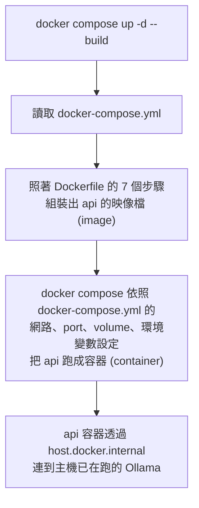
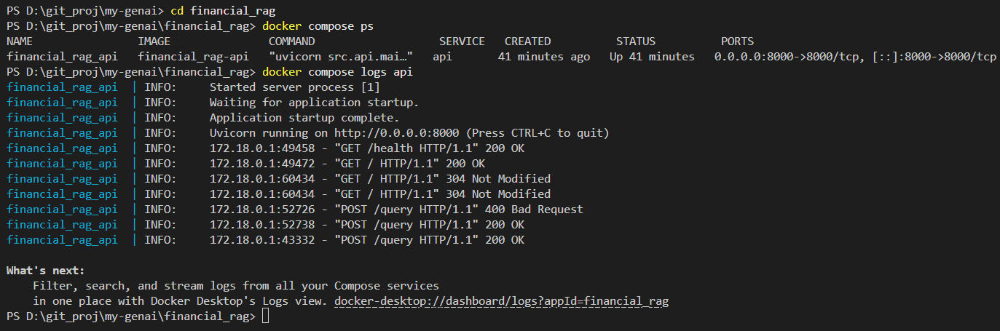
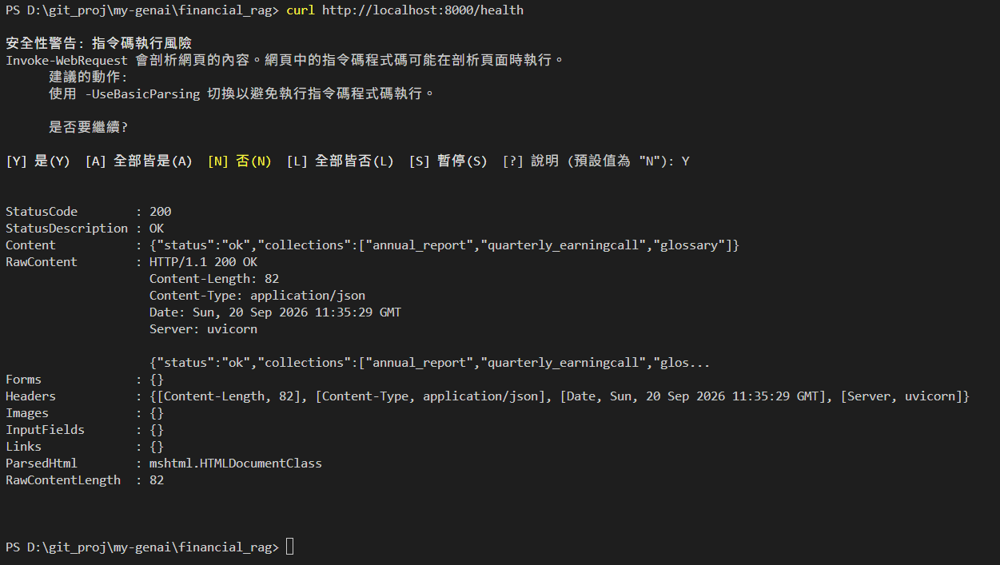
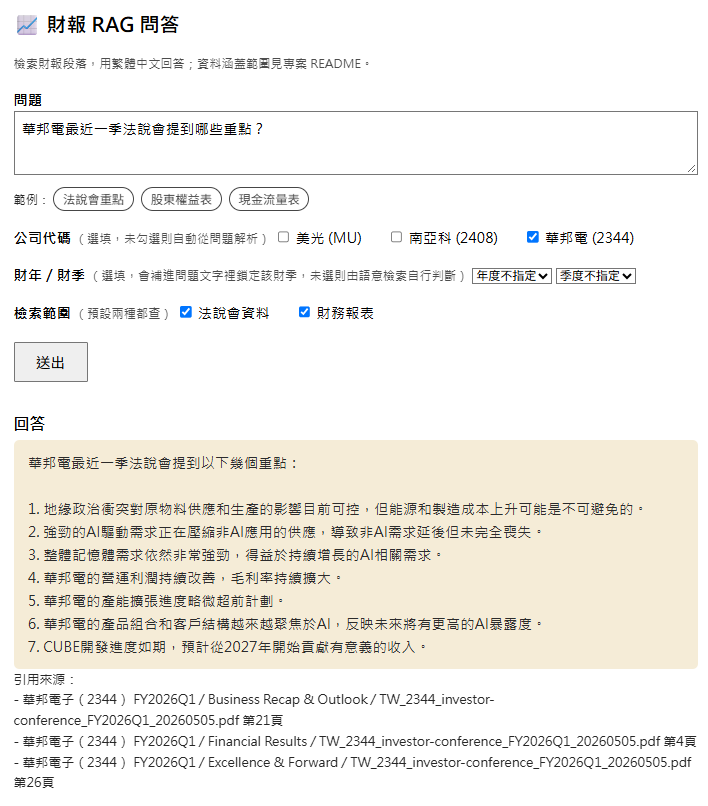

# Docker 部署補充說明

本文件是延伸 [README.md](README.md) 「快速開始」的章節，整理 Docker 相關指令的細部說明，主要提供不熟悉 Docker 操作的協作者閱讀。

## 1. Docker 基本概念

Docker 不是直接拿現成的映像檔來跑，而是在本機照著 Dockerfile 的步驟重新組裝一份新的映像檔，再用它啟動容器。

- 映像檔/快照 (image)：打包好的作業系統 + 程式環境的快照。
- 容器 (container)：拿這份快照實際跑起來的執行實體。
- `--build`：重新做一次快照，而不是沿用舊快照。

### 1-1. Docker 執行流程與對應檔案

Docker 的運作可以拆成 3 層，本專案每一層各自對應到一個檔案：

| 層級 | 英文對照 | 負責任務 | 對應檔案 |
| --- | --- | --- | --- |
| **1. 建置規則** | Build definition<br>Dockerfile 如何變成 image | 定義**單一** service 的映像檔要如何組裝起來，包括從哪個基底開始、裝什麼套件、複製哪些檔案、啟動指令是什麼。<br>本專案只有 `api` 映像是要用自建；Ollama 不跑在容器裡，而是使用本機（Windows 端）已經在跑的 Ollama。 | [Dockerfile](Dockerfile) |
| **2. 編排規則** | Orchestration<br>docker-compose.yml 如何建立 docker services | 定義**多個** service 要怎麼協同運作，包括誰要 build、誰用現成映像、彼此的網路連線、要開哪些 port、掛載哪些 volume、環境變數。<br>本專案中是描述 `api` 這個 service，並透過 `host.docker.internal` 連到主機上的 Ollama。 | [docker-compose.yml](docker-compose.yml) |
| **3. 執行實體** | Runtime<br>執行 `docker compose up` 產生 containers | 透過 Docker 指令，依照第一、二層設定建置映像檔、啟動容器實體。 | 沒有任何對應檔案 |


### 1-3. Docker 執行順序


對照 [Dockerfile](Dockerfile) 理解建置 image 的步驟

```dockerfile
FROM python:3.11-slim        # 1. 從官方 Python 3.11 精簡版映像檔開始，作為基底環境
WORKDIR /app                 # 2. 容器裡切到 /app 目錄，之後指令都在這裡執行
COPY requirements.txt .      # 3. 先只複製 requirements.txt
RUN pip install -r requirements.txt   # 4. 安裝套件（分開這兩步是為了讓 build cache 能沿用）
COPY src/ src/                # 5. 複製原始碼進映像檔
COPY scripts/ scripts/
EXPOSE 8000                  # 6. 標記會用 8000 port（僅文件性質，實際開放靠 compose 的 ports 設定）
CMD ["uvicorn", ...]          # 7. 容器啟動時執行的指令
```

### 1-4. `docker compose up -d --build` 的行為

讀取 [docker-compose.yml](docker-compose.yml) 定義的 `api` service，建立或啟動容器：

- **`api` service**：用 [Dockerfile](Dockerfile) 重新建置映像檔，設定連到主機 Ollama 的環境變數（`OLLAMA_HOST`/`OLLAMA_URL=http://host.docker.internal:11434`），開 `8000` port，並把主機的 `./data` 掛成容器內的 `/app/data`（資料留在主機，不會因容器重建而消失）。
- 容器設定 `restart: unless-stopped`，主機重開機也會自動再啟動。
- Ollama 本身**不會**跑在容器裡，而是沿用本機（Windows 端）已經在跑、且已經 `ollama pull` 過模型的 Ollama。跑之前請先確認本機 Ollama 服務已啟動（`ollama serve` 或 Ollama 應用程式常駐），且 `docker compose up` 前終端機可以連到 `http://localhost:11434`；容器內則靠 Docker Desktop 內建的 `host.docker.internal` 對應到主機。

### 1-5. `docker compose up -d` vs. `docker compose up -d --build`

| 比較 | `docker compose up -d` | `docker compose up -d --build` |
| --- | --- | --- |
| 映像檔來源 | 若本機已有對應映像檔，直接沿用，不會重新跑 Dockerfile | 一定會重新跑一次 Dockerfile 建置流程（靠 build cache 加速，但流程本身一定執行） |
| 何時該用 | 程式碼、`requirements.txt` 都沒變，只是要啟動/重啟容器 | 改了 `src/`、`scripts/`、`requirements.txt`、`Dockerfile` 之後，要讓容器跑到最新程式碼 |
| 風險 | 忘記加 `--build` 時，改動不會生效，容器繼續跑舊版程式碼 | 沒有風險，只是多花一點時間（沒改動的層靠 cache 秒過） |

> `up` 負責「啟動容器」。<br>
> `--build` 是額外要求「啟動前先確保映像檔是最新的」。<br>
> **強烈建議**：開發階段都要加上 `--build`（成本低、避免踩坑）；只有當明確知道「這次只是改 compose 設定、沒動程式碼」時，才省略。

## 2. 部署時的模型與資料

> 部署到新環境時，模型本身 (Ollama) 與原始資料 (`data/`) 都不隨 Docker 容器打包，而是各自掛載或連接既有主機資源。

### 2-1. 不做 Ollama 模型的容器化

模型推論服務 (Ollama、vLLM) 常見的做法就是讓它常駐在主機上，而不是塞進 docker compose 裡，原因：

- **模型檔案大、且需要 GPU 直通**：塞進容器會讓 image 變笨重，GPU passthrough 還得另外裝 Nvidia Container Toolkit，設定更複雜。
- **模型不會因容器重建而消失**：本機的 Ollama 是獨立行程，`docker compose up --build` 重建 `api` 容器完全不影響它，也不用重新下載模型。
- **容器只需要用網路呼叫它**：`api` 服務只是透過 `OLLAMA_HOST`/`OLLAMA_URL` 打 HTTP API，跟 Ollama 是否容器化無關。

> 若之後需要更完整的可攜性（例如換一台全新主機時不想手動裝 Ollama），才會考慮改回容器化的 `ollama` service（可參考 git 歷史還原）。

### 2-2. 不把原始資料放入 git，也不必把 chroma_db 複製到 container

`financial_rag/data/` 不在 git repo 裡（檔案大、且屬敏感/授權資料），需要 clone 完專案後自行放到根目錄，內容理應包含：

- `data/raw/`：原始財報文件（PDF/HTML），依公司分子資料夾（`10K`、`TW_AIA`、`investor`、`glossary`）
- `data/manifest.json`：機器可讀的來源索引清單，由 `scripts/generate_manifest.py` 掃描 `data/raw/` 自動產生，供 `ingest_data.py` 讀取
- `data/processed/parsed/`、`data/processed/chunks/`：前處理中繼產物
- `data/chroma_db/`：向量資料庫本體（ChromaDB 為內嵌式，不需獨立伺服器容器）

- 建置 ChromaDB 的兩種處理情境
    1. 如已有現成的 `data/chroma_db/`（資料沒變、只是換環境）：直接把整個 `data/` 放進去，啟動後即可查詢，不用重新處理。
    2. 只有 `data/raw/` 原始文件，還沒建過向量庫：需先跑 `generate_manifest.py` → 解析/切塊 → `ingest_data.py`。

## 3. 驗證 Docker 成功部署方法

部署到新主機後，建議由淺到深依序確認，每一層都對應到不同的失敗原因：

1. **確認容器有沒有起來**
   ```bash
   cd financial_rag
   docker compose ps        # STATUS 應為 Up
   docker compose logs api  # 看有沒有啟動階段的錯誤堆疊
   ```
   若容器一直重啟或 `Exited`，通常是 `OLLAMA_HOST`/`OLLAMA_URL` 連不到主機 Ollama、或 `./data` 掛載路徑不存在。

   

2. **檢查 `/health` 是否正常**（只驗證 ChromaDB，不驗證 Ollama）
   ```bash
   curl http://localhost:8000/health
   # 預期：{"status":"ok","collections":["annual_report","quarterly_earningcall","glossary"]}
   ```
   若回 503，代表 `data/chroma_db/` 沒有正確掛進容器，或三個 collection 不存在（可能是還沒跑過 `ingest_data.py`，見 §2-2）。

   

3. **測試完整流程是否正常**（會實際打到主機 Ollama，驗證 `host.docker.internal` 連線與模型是否已下載）
   ```bash
   docker compose exec api python scripts/test_api.py
   ```
   這支腳本會依序驗證 `/health` 與 `/query`（對 golden set 其中一題跑完整 RAG 流程：檢索 → glossary 比對 → LLM 生成），任何一步失敗都會直接印出錯誤。若卡在 `/query`，多半是主機 Ollama 沒啟動、或兩顆模型還沒 `ollama pull`（見 §2-1）。

4. **透過 UI 執行人工複核**：瀏覽器開啟 http://localhost:8000/docs（Swagger UI）或 http://localhost:8000/（查詢頁面），手動送一題確認回答與引用來源合理。

   


## 4. 重啟、更新、移除

### 4-1. 關閉這次部署好的服務

不用特別為了「下次還要用 `up -d`/`up -d --build`」而先關閉這次的服務——這兩個指令都是**冪等(idempotent)**的，執行時會自動偵測容器目前狀態、需要就地更新或重建，不需要手動先關掉（細節見 §4-2）。

實務上有 2 種情境：

- **結束這次工作階段，釋放資源**（保留容器設定）：
  ```bash
  docker compose stop
  ```
  只停止容器，不刪除；之後想繼續就直接 `docker compose start` 或 `docker compose up -d`。

  > ⚠️ `docker compose stop` 只會停止 `api` 容器，**不會**影響跑在主機上的 Ollama——GPU/CPU 是被 Ollama 佔用，不是被容器佔用，還需要另外處理 Ollama 本身，依「要釋放多久」擇一：
  > 1. **什麼都不做，等自動釋放**：如 §1 提到，Ollama 預設閒置 5 分鐘後會自動把模型從 VRAM 卸載，不需要手動介入。
  > 2. **立即釋放，但 Ollama 服務繼續跑**：
  >    ```bash
  >    ollama stop jcai/llama-3-taiwan-8b-instruct:q4_k_m
  >    ollama stop bge-m3
  >    ```
  >    把模型從記憶體卸載，但 Ollama 服務（`ollama serve`）仍在背景待命，下次呼叫會重新載入。
  > 3. **完全關閉 Ollama 服務**（連 CPU 背景行程都不留）：把 Ollama 應用程式/服務關掉（工作管理員結束 `ollama.exe`，或若是用 `ollama serve` 手動啟動的就 Ctrl+C）。下次要用就得重新啟動 Ollama 服務。

- **完整地移除這次的容器部署**（不只是暫停，之後也再用 `up -d` 接續）：
  ```bash
  docker compose down             # 停止並刪除容器、預設 network，不動 volume 和 image
  docker compose down --rmi local # 加上這個順便刪掉本地建置的 image（financial_rag-api）
  ```
  - `./data` 是 bind mount（不是 named volume），`down` 完全不會動到主機上的 `data/` 資料夾，可以放心清除容器。
  - 目前沒有 named volume（Ollama 模型掛在主機，不是 docker volume），不需要加 `-v` 參數；若想順手確認沒有殘留 volume，可用 `docker volume ls` 檢查。

### 4-2. 下次只要重啟、不重新部署

不特別關心資源占用、也不打算先執行 §4-1 的 `stop`/`down` 時，什麼都不用做，直接放著即可——下次不管是 `docker compose up -d`（沒變動就跳過重建）還是 `docker compose up -d --build`（強制重建映像檔），Docker 都會自動處理目前容器（替換掉舊的），不會因為容器還在跑而出錯或殘留舊容器。

程式碼、`requirements.txt`、`Dockerfile` 都沒變時，直接沿用既有映像檔：

```bash
docker compose up -d
```
