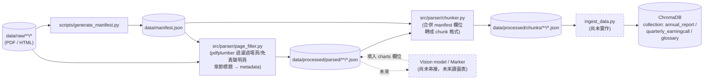

# `data/manifest.json` 欄位規格

`data/manifest.json` 是 `data/raw/` 底下所有來源文件的機器可讀清單，供 `ingest_data.py` 讀取寫入向量資料庫的 metadata，不需要每次都重新解析檔名。由 `scripts/generate_manifest.py` 掃描 `data/raw/` 自動產生，新增/搬動檔案後重新執行該腳本即可更新。

```bash
conda activate financial_rag
python scripts/generate_manifest.py
```

## Pipeline 階段與資料夾

`data/processed/` 依處理階段分成兩個獨立子資料夾，結構鏡射 `data/raw/`：

| 階段 | 資料夾 | 產生腳本 | 內容 |
| --- | --- | --- | --- |
| 中繼（parsed） | `data/processed/parsed/` | `src/parser/page_filter.py` | 過濾過場頁/免責聲明頁後的乾淨文字，附章節 metadata |
| 最終（chunks） | `data/processed/chunks/` | `src/parser/chunker.py` | 合併 manifest metadata 後的 chunk，格式可直接餵給 ChromaDB |

不同階段的產物放在不同資料夾，而非同一層用檔名後綴區分，方便日後用 glob（如 `data/processed/chunks/**/*.json`）一次批次處理某個階段的全部產物。



## 欄位總表

| 欄位 | 型別 | 適用範圍 | 說明 |
| --- | --- | --- | --- |
| `id` | string | 全部 | 檔名（去除副檔名），作為唯一鍵，不隨路徑搬動而改變 |
| `raw_path` | string | 全部 | 對應 `data/raw/` 的相對路徑 |
| `parsed_path` | string | 全部 | `page_filter.py` 應寫入的中繼產物路徑，對應 `data/processed/parsed/` |
| `chunks_path` | string | 全部 | `chunker.py` 應寫入的最終 chunk 路徑，對應 `data/processed/chunks/`，可直接餵給 ChromaDB |
| `collection` | string | 全部 | 對應的向量資料庫 collection：`annual_report`／`quarterly_earningcall`／`glossary` |
| `market` | string \| null | 除 glossary 外 | 發行股票市場，`US`／`TW` |
| `ticker` | string \| null | 除 glossary 外 | 股票代碼 |
| `company_name` | string \| null | 除 glossary 外 | 公司英文全名 |
| `company_name_zh` | string \| null | 除 glossary 外 | 公司中文名稱，供繁體中文回答時 citation 使用 |
| `doc_category` | string | 全部 | 上層分類：`annual_report`／`quarterly_earningcall`／`glossary` |
| `doc_type` | string | 全部 | 下層文件類型：`10K`／`AIA`／`investor-conference`／`earning-deck`／`prepared-remarks`／`tifrs-glossary` |
| `file_format` | string | 全部 | 實際檔案格式：`html`／`pdf`，決定要套用哪個 parser |
| `language` | string | 全部 | 文件語言：`en`（三家公司皆抓英文版財報/簡報）、`zh-en`（glossary 為中英對照） |
| `accounting_standard` | string \| null | 除 glossary 外 | `US GAAP`（美股）／`T-IFRS`（台股），決定是否需要套用會計科目對照表做語意橋接 |
| `fiscal_year` | string \| null | 全部（除 glossary） | 財年標籤 `FY{年}`（不含季度）。從檔名的 `FY{年}[Q{n}]` 片段取得年份部分；annual_report 若檔名未帶 `FY{年}`，退回用結算日反推 |
| `fiscal_period` | string \| null | quarterly_earningcall | 完整財季標籤 `FY{年}Q{n}`（如 `FY2025Q1`），annual_report 恆為 `null` |
| `fiscal_period_end` | string \| null | annual_report | 財報結算日（ISO 格式），**非**發布/下載日 |
| `event_date` | string \| null | quarterly_earningcall | 法說會**實際召開日期**（ISO 格式）。⚠️ 與財季結算日不同，法說會通常在季度結束後數週才召開 |
| `source_url` | string \| null | 全部 | 來源網站（目前為公司層級的來源頁面，非單一檔案的精確連結） |
| `retrieved_date` | string \| null | 全部 | 下載日期，目前尚未回填，需手動補上 |
| `ingestion_status` | string | 全部 | 處理進度：`pending`／`chunked`／`ingested`，供 `ingest_data.py` 判斷是否需要處理（支援 Incremental Upsert） |
| `chunk_count` | integer \| null | 全部 | 該文件切出的 chunk 數，處理完成後回填 |
| `ingested_at` | string \| null | 全部 | 寫入向量資料庫的時間戳記，處理完成後回填 |

## 已知待補欄位

自動產生的 `data/manifest.json` 中，以下欄位目前為 `null`，需要之後手動或另外撰寫腳本回填：

- **`retrieved_date`**：目前所有文件皆為 `null`，建議之後改用檔案下載時自動寫入，或手動回填實際下載日期。
- **`source_url` 的精確度**：目前只記錄到公司層級的來源頁面（如 SEC filings 列表頁），並非每份文件的精確深連結。若需要在 citation 中附上可回溯的原始連結，需另外補上單一文件層級的 URL。

## 財季標籤（`FY{年}Q{n}`）需人工核對

`quarterly_earningcall` 類檔名的 `FY{年}Q{n}` 標籤是法說會**歸屬的財季**，與檔名日期（`event_date`，法說會實際召開日）是兩件事，且兩者常跨年（例如 12 月法說會可能是在報告下一個財年 Q1）。新增檔案時務必人工核對財季歸屬後再命名，避免財季標籤重複或跳號——可用以下指令快速檢查同一 `doc_type` 底下是否有重複或不連續的 `fiscal_period`：

```bash
python -c "
import json
from collections import Counter
m = json.load(open('data/manifest.json', encoding='utf-8'))
c = Counter((d['doc_type'], d['ticker'], d['fiscal_period']) for d in m['documents'] if d['doc_category']=='quarterly_earningcall')
dupes = [k for k, v in c.items() if v > 1]
print('重複財季標籤:', dupes or '無')
"
```

## 範例

```json
{
  "id": "US_MU_earning-deck_FY2026Q3_20260624",
  "raw_path": "data/raw/quarterly_earningcall/US_earning_call/US_MU/US_MU_earning-deck_FY2026Q3_20260624.pdf",
  "parsed_path": "data/processed/parsed/quarterly_earningcall/US_earning_call/US_MU/US_MU_earning-deck_FY2026Q3_20260624.json",
  "chunks_path": "data/processed/chunks/quarterly_earningcall/US_earning_call/US_MU/US_MU_earning-deck_FY2026Q3_20260624.json",
  "collection": "quarterly_earningcall",
  "market": "US",
  "ticker": "MU",
  "company_name": "Micron Technology, Inc.",
  "company_name_zh": "美光科技",
  "doc_category": "quarterly_earningcall",
  "doc_type": "earning-deck",
  "file_format": "pdf",
  "language": "en",
  "accounting_standard": "US GAAP",
  "fiscal_year": "FY2026",
  "fiscal_period": "FY2026Q3",
  "fiscal_period_end": null,
  "event_date": "2026-06-24",
  "source_url": "https://investors.micron.com/events-and-presentations",
  "retrieved_date": null,
  "ingestion_status": "pending",
  "chunk_count": null,
  "ingested_at": null
}
```
