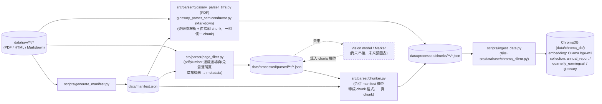

# `data/manifest.json` 欄位規格

`data/manifest.json` 是 `data/raw/` 底下所有來源文件的機器可讀清單，供 `ingest_data.py` 讀取寫入向量資料庫的 metadata，不需要每次都重新解析檔名。由 `scripts/generate_manifest.py` 掃描 `data/raw/` 自動產生，新增/搬動檔案後重新執行該腳本即可更新。

```bash
conda activate financial_rag
python scripts/generate_manifest.py
```

## Pipeline 階段與資料夾

`data/processed/` 依處理階段分成兩個獨立子資料夾，結構鏡射 `data/raw/`：

| 階段 | 資料夾 | 產生腳本 | 內容 |
| --- | --- | --- | --- |
| 中繼（parsed） | `data/processed/parsed/` | `src/parser/page_filter.py`（財報）／`src/parser/glossary_parser_*.py`（詞彙表） | 財報：過濾過場頁/免責聲明頁後的乾淨文字，附章節 metadata。詞彙表：逐詞條解析出的 `{item, term_en, term_zh, ...}` list |
| 最終（chunks） | `data/processed/chunks/` | `src/parser/chunker.py`（財報，一頁一 chunk）／`glossary_parser_*.py` 的 `build_*_chunks()`（詞彙表，一詞條一 chunk） | 合併 manifest metadata 後的 chunk，格式可直接餵給 ChromaDB |
| 向量化（chroma_db） | `data/chroma_db/` | `scripts/ingest_data.py` | 寫入 ChromaDB 的向量與 metadata，供檢索用 |

不同階段的產物放在不同資料夾，而非同一層用檔名後綴區分，方便日後用 glob（如 `data/processed/chunks/**/*.json`）一次批次處理某個階段的全部產物。

財報類文件（`annual_report`／`quarterly_earningcall`）與詞彙表類文件（`glossary`）走兩條不同的 parsed→chunks 路徑，但兩者的 chunk 輸出格式（`{"id","document","metadata"}`）與最終寫入 ChromaDB 的方式完全一致，`ingest_data.py`／`chroma_client.py` 不需要區分來源格式，見下方「Glossary 詞彙表的特殊處理」。



## 新增資料標準作業流程 (SOP)

新資料寫入向量資料庫前，依序執行：

### 1. 放置原始檔案

依照本文件與 README §6 的命名規則，把檔案放到 `data/raw/` 對應的分類/公司資料夾，檔名格式：

```
{market}_{ticker}_{doc_type}_[{FY年}[Q{季}]_]{YYYYMMDD}[_補充說明].{ext}
```

例如：`data/raw/quarterly_earningcall/US_earning_call/US_MU/US_MU_earning-deck_FY2026Q4_20260923.pdf`

### 2. 重新產生 manifest

```bash
conda activate financial_rag
python scripts/generate_manifest.py
```

掃描 `data/raw/` 產生最新的 `data/manifest.json`，新檔案會自動被抓進來，並算出 `parsed_path`／`chunks_path`。

### 3. 執行 page filter（清洗）

```bash
python -m src.parser.page_filter "data/raw/.../新檔案.pdf"
```

輸出到 `data/processed/parsed/.../新檔案.json`。

⚠️ **注意**：`page_filter.py` 的章節偵測與頁尾格式是依 `(ticker, doc_type)` 查表分派（`SECTION_STRATEGIES`／`FOOTER_PATTERNS`，見 `src/parser/page_filter.py`）。

- 若是**既有公司**（美光 MU／南亞科 2408／華邦電 2344）的**既有 doc_type**：直接套用現成規則即可。
- 若是**新公司**或**新 doc_type**：目前會自動退回預設的 `"01."` 樣式偵測，格式不同的話 `section` 可能抓不到或抓錯，**執行完後務必檢查輸出的 `discarded_pages`／`valid_pages` 的 `section` 欄位是否合理**，格式不同就要照現有模式（`make_numeric_dot_detector`／`make_agenda_detector`／`inline_heading`）加一組新的偵測邏輯。

### 4. 執行 chunker（轉成 ChromaDB 格式）

```bash
python -m src.parser.chunker "data/processed/parsed/.../新檔案.json"
```

輸出到 `data/processed/chunks/.../新檔案.json`，合併 manifest metadata、附上 `content_hash`，可直接餵給 ChromaDB。

### 5. 寫入 ChromaDB

```bash
python scripts/ingest_data.py                                    # 補齊全部尚未 ingest 的項目（依 manifest ingestion_status 判斷）
python scripts/ingest_data.py "data/processed/chunks/.../新檔案.json"  # 只處理指定檔案
```

讀取 chunk 檔案的 `id`／`document`／`metadata`，用 `collection.upsert(...)` 寫入對應的 collection（`annual_report`／`quarterly_earningcall`／`glossary`，向量存放於 `data/chroma_db/`），並回填 `manifest.json` 的 `ingestion_status`（`pending`→`ingested`）／`chunk_count`／`ingested_at`。用 `upsert` 而非 `add`，同一份文件重新處理後再次執行不會報錯或產生重複 chunk。

不帶參數執行時，若 manifest 中某筆項目的 `chunks_path` 檔案還不存在（例如尚未跑完步驟 3、4），會印出提示並跳過，不會中斷整個批次。

⚠️ **Embedding 模型**：`src/database/chroma_client.py` 固定使用 README §1 指定的 Ollama `bge-m3:latest`（透過 `chromadb.utils.embedding_functions.OllamaEmbeddingFunction`，需本機 Ollama 服務可連線），而非 Chroma 預設的英文 `all-MiniLM-L6-v2`，以確保英文財報段落與繁中提問能語意對齊。若日後更換 embedding 模型或版本，向量維度可能改變，需先清空 `data/chroma_db/`、重置相關項目的 `ingestion_status` 後全部重新 ingest，不能與舊向量混用同一個 collection。

⚠️ **批次寫入上限**：`chroma_client.upsert_chunks()` 內建每批 100 筆分批寫入（`_UPSERT_BATCH_SIZE`）。曾經一次把近 2000 筆詞彙表詞條全部丟給 Ollama 的 `/embed` 端點，導致其模型 runner 掛掉、後續請求全部連線被拒；新增大量 chunk（尤其是詞彙表這種一次上千筆的情境）務必確認走的是分批後的 `upsert_chunks()`，不要繞過它直接呼叫 `collection.upsert()`。

## Glossary 詞彙表的特殊處理

`doc_category: "glossary"` 的文件（中英對照詞彙表）**不走** `page_filter.py`／`chunker.py`：這兩支是為了處理財報頁面「圖表＋表格＋敘述文字混雜」的版面設計的，套在乾淨的詞彙表格上是殺雞用牛刀，而且「一頁一 chunk」會把每頁十幾到數十個詞條混進同一個 chunk，語意檢索時被同頁其他不相關詞條稀釋、精準度變差。

詞彙表改用**專屬解析器**，命名規則為 `src/parser/glossary_parser_{類型}.py`，直接輸出「一詞條一 chunk」：

| 詞彙表 | 來源格式 | 解析器 | 詞條數 |
| --- | --- | --- | --- |
| `tifrs_glossary_latest` | PDF（3 欄表格：Item / Term in English / Term in Chinese） | `src/parser/glossary_parser_tifrs.py` | 1949 |
| `semiconductor_glossary_latest` | Markdown（`## ` 分節 + 3 欄表格：英文／中文／說明） | `src/parser/glossary_parser_semiconductor.py` | 53 |

兩者 chunk 內容都是 `document = "English: {term_en}\nChinese: {term_zh}"`（半導體詞彙表另外附加 `Description: {description}`），寫進同一個 ChromaDB `glossary` collection，用 metadata 的 `source_id` 區分來源，不需要為每份詞彙表另開一個 collection。

### 新增一份詞彙表的步驟

1. 把來源檔案放進 `data/raw/glossary/`。
2. 在 `scripts/generate_manifest.py` 的 `GLOSSARY_INFO` dict 裡註冊該檔名對應的 `doc_type`／`language`／`accounting_standard`／`source_url`——**沒有註冊就重跑會直接報錯**（避免新詞彙表被誤套用到別份詞彙表的來源資訊）。
3. 依來源格式選用或新寫一支 `src/parser/glossary_parser_{類型}.py`，輸出格式需比照既有兩支：`parse_*()` 回傳詞條 list（至少含 `term_en`／`term_zh`），`build_*_chunks(doc_id, terms)` 轉成 `{"id","document","metadata"}` chunk 陣列。
4. 重跑 `python scripts/generate_manifest.py` → 執行新解析器輸出 parsed／chunks JSON → `python scripts/ingest_data.py <chunks_path>`。
5. `src/rag/glossary_lookup.py`（精確比對，不透過 embedding）與 `src/rag/glossary_matcher.py`（LLM 抓詞 + 語意比對）都會自動涵蓋新詞彙表，前者掃描 `data/processed/parsed/glossary/*.json` 全部檔案、後者查詢的是整個 `glossary` collection，不需要另外修改。

⚠️ **manifest 重新產生的副作用**：`generate_manifest.py` 是整份覆寫 `data/manifest.json`，每次重跑都會把**所有**文件的 `ingestion_status` 重置回 `pending`（不只是新增的那筆）。這不影響 ChromaDB 裡已經 ingest 的資料（`upsert` 是 idempotent），但跑完後記得對其餘已完成的文件重新跑一次 `python scripts/ingest_data.py`（不帶參數，補齊全部 `pending` 項目）把狀態補回 `ingested`。

## 欄位總表

| 欄位 | 型別 | 適用範圍 | 說明 |
| --- | --- | --- | --- |
| `id` | string | 全部 | 檔名（去除副檔名），作為唯一鍵，不隨路徑搬動而改變 |
| `raw_path` | string | 全部 | 對應 `data/raw/` 的相對路徑 |
| `parsed_path` | string | 全部 | 中繼產物路徑，對應 `data/processed/parsed/`；財報類由 `page_filter.py` 寫入，glossary 類由對應的 `glossary_parser_*.py` 寫入 |
| `chunks_path` | string | 全部 | 最終 chunk 路徑，對應 `data/processed/chunks/`，可直接餵給 ChromaDB；財報類由 `chunker.py` 寫入，glossary 類由 `glossary_parser_*.py` 的 `build_*_chunks()` 寫入 |
| `collection` | string | 全部 | 對應的向量資料庫 collection：`annual_report`／`quarterly_earningcall`／`glossary` |
| `market` | string \| null | 除 glossary 外 | 發行股票市場，`US`／`TW` |
| `ticker` | string \| null | 除 glossary 外 | 股票代碼 |
| `company_name` | string \| null | 除 glossary 外 | 公司英文全名 |
| `company_name_zh` | string \| null | 除 glossary 外 | 公司中文名稱，供繁體中文回答時 citation 使用 |
| `doc_category` | string | 全部 | 上層分類：`annual_report`／`quarterly_earningcall`／`glossary` |
| `doc_type` | string | 全部 | 下層文件類型：`10K`／`AIA`／`investor-conference`／`earning-deck`／`prepared-remarks`／`tifrs-glossary`／`semiconductor-glossary`（glossary 類的 `doc_type` 對照表見 `scripts/generate_manifest.py` 的 `GLOSSARY_INFO`） |
| `file_format` | string | 全部 | 實際檔案格式：`html`／`pdf`／`md`，決定要套用哪個 parser |
| `language` | string | 全部 | 文件語言：`en`（三家公司皆抓英文版財報/簡報）、`zh-en`（glossary 皆為中英對照） |
| `accounting_standard` | string \| null | 除 glossary 外 | `US GAAP`（美股）／`T-IFRS`（台股），決定是否需要套用會計科目對照表做語意橋接 |
| `fiscal_year` | string \| null | 全部（除 glossary） | 財年標籤 `FY{年}`（不含季度）。從檔名的 `FY{年}[Q{n}]` 片段取得年份部分；annual_report 若檔名未帶 `FY{年}`，退回用結算日反推 |
| `fiscal_period` | string \| null | quarterly_earningcall | 完整財季標籤 `FY{年}Q{n}`（如 `FY2025Q1`），annual_report 恆為 `null` |
| `fiscal_period_end` | string \| null | annual_report | 財報結算日（ISO 格式），**非**發布/下載日 |
| `event_date` | string \| null | quarterly_earningcall | 法說會**實際召開日期**（ISO 格式）。⚠️ 與財季結算日不同，法說會通常在季度結束後數週才召開 |
| `source_url` | string \| null | 全部 | 來源網站（目前為公司層級的來源頁面，非單一檔案的精確連結） |
| `retrieved_date` | string \| null | 全部 | 下載日期，目前尚未回填，需手動補上 |
| `ingestion_status` | string | 全部 | 處理進度：`pending`／`chunked`／`ingested`，供 `ingest_data.py` 判斷是否需要處理（支援 Incremental Upsert） |
| `chunk_count` | integer \| null | 全部 | 該文件切出的 chunk 數，處理完成後回填 |
| `ingested_at` | string \| null | 全部 | 寫入向量資料庫的時間戳記，處理完成後回填 |

## 已知待補欄位

自動產生的 `data/manifest.json` 中，以下欄位目前為 `null`，需要之後手動或另外撰寫腳本回填：

- **`retrieved_date`**：目前所有文件皆為 `null`，建議之後改用檔案下載時自動寫入，或手動回填實際下載日期。
- **`source_url` 的精確度**：目前只記錄到公司層級的來源頁面（如 SEC filings 列表頁），並非每份文件的精確深連結。若需要在 citation 中附上可回溯的原始連結，需另外補上單一文件層級的 URL。

## 財季標籤（`FY{年}Q{n}`）需人工核對

`quarterly_earningcall` 類檔名的 `FY{年}Q{n}` 標籤是法說會**歸屬的財季**，與檔名日期（`event_date`，法說會實際召開日）是兩件事，且兩者常跨年（例如 12 月法說會可能是在報告下一個財年 Q1）。新增檔案時務必人工核對財季歸屬後再命名，避免財季標籤重複或跳號——可用以下指令快速檢查同一 `doc_type` 底下是否有重複或不連續的 `fiscal_period`：

```bash
python -c "
import json
from collections import Counter
m = json.load(open('data/manifest.json', encoding='utf-8'))
c = Counter((d['doc_type'], d['ticker'], d['fiscal_period']) for d in m['documents'] if d['doc_category']=='quarterly_earningcall')
dupes = [k for k, v in c.items() if v > 1]
print('重複財季標籤:', dupes or '無')
"
```

## 範例

```json
{
  "id": "US_MU_earning-deck_FY2026Q3_20260624",
  "raw_path": "data/raw/quarterly_earningcall/US_earning_call/US_MU/US_MU_earning-deck_FY2026Q3_20260624.pdf",
  "parsed_path": "data/processed/parsed/quarterly_earningcall/US_earning_call/US_MU/US_MU_earning-deck_FY2026Q3_20260624.json",
  "chunks_path": "data/processed/chunks/quarterly_earningcall/US_earning_call/US_MU/US_MU_earning-deck_FY2026Q3_20260624.json",
  "collection": "quarterly_earningcall",
  "market": "US",
  "ticker": "MU",
  "company_name": "Micron Technology, Inc.",
  "company_name_zh": "美光科技",
  "doc_category": "quarterly_earningcall",
  "doc_type": "earning-deck",
  "file_format": "pdf",
  "language": "en",
  "accounting_standard": "US GAAP",
  "fiscal_year": "FY2026",
  "fiscal_period": "FY2026Q3",
  "fiscal_period_end": null,
  "event_date": "2026-06-24",
  "source_url": "https://investors.micron.com/events-and-presentations",
  "retrieved_date": null,
  "ingestion_status": "pending",
  "chunk_count": null,
  "ingested_at": null
}
```
