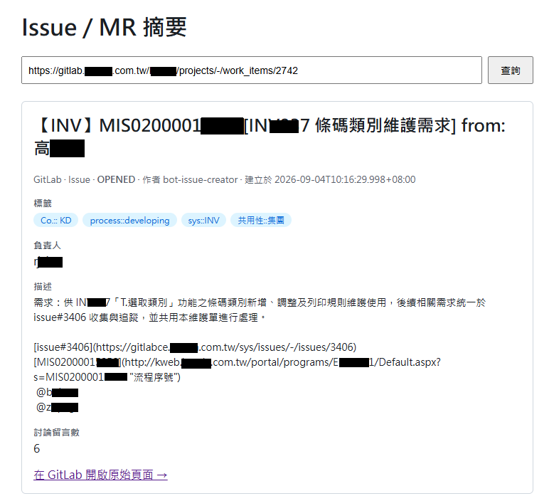
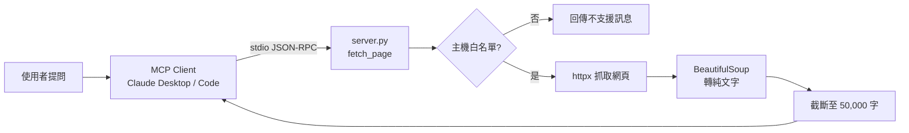
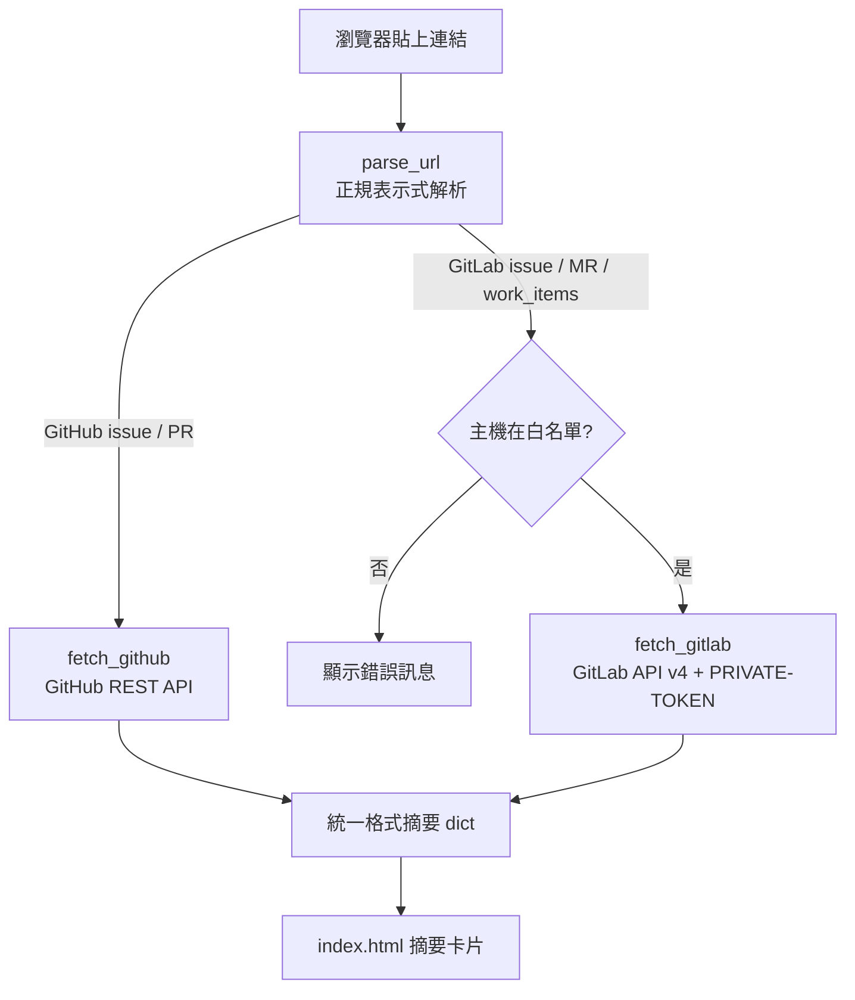
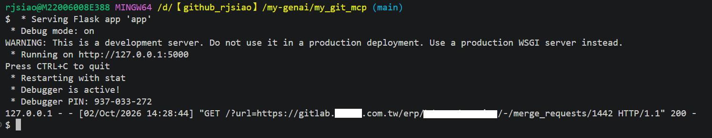
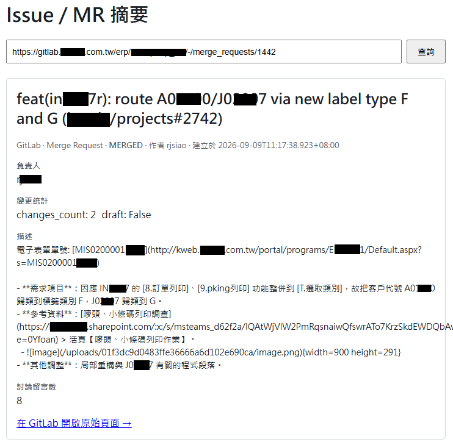

# 🔗 my_git_mcp：GitHub / GitLab 內容讀取工具（MCP Server × Flask 網頁）



## 1. 專案概述

本專案提供**兩種使用方式**讀取 GitHub / GitLab 內容：

1. **自建 MCP server**（`server.py`）：註冊到 MCP Client（Claude Desktop / Claude Code），在對話中直接讀取 GitHub / GitLab 網頁或原始檔
2. **獨立 Flask 網頁**（`app.py`）：貼上 issue / PR / MR 連結，顯示結構化摘要

**做了什麼**

- 以 FastMCP 實作 `fetch_page` 工具，讓 LLM 在對話中抓取 GitHub / GitLab 頁面並轉成純文字
- 以 Flask 實作查詢頁面，呼叫 GitHub REST API / GitLab API v4，將 issue / PR / MR 整理成統一格式的摘要卡片
- 支援同時串接多個自架 GitLab 主機（各自一把 token），並以主機白名單防範 SSRF

**主要技術**

| 類別 | 技術 |
| --- | --- |
| MCP Server | `mcp`（FastMCP，stdio + JSON-RPC） |
| 網頁服務 | Flask、Jinja2 模板 |
| HTTP 請求 | httpx |
| HTML 解析 | BeautifulSoup |
| 外部 API | GitHub REST API、GitLab API v4 |

## 2. 問題與動機

- **自架 GitLab 位於內網**：公司內部的自架 GitLab 需要 token 才能存取，一般的網頁抓取工具無法讀取。
- **issue / MR 資訊分散**：一個 issue / MR 的狀態、作者、標籤、指派人、留言數、異動檔案數散落在頁面各處，想快速掌握概況時需要逐一點開查看。
- **GitHub 與 GitLab 格式不同**：兩個平台的 API 欄位名稱與 URL 結構不同，例如 PR vs. MR、`user.login` vs. `author.username`，比較或彙整時需要自行對照。

因此目標是做一個**能讓 LLM 在對話中直接讀取 Git 平台內容**，並能**用統一格式快速查看 issue / PR / MR 摘要**的工具。

## 3. 解決方案

依使用情境拆成兩個獨立入口，共用同一份依賴套件：

| 比較項目 | 對話助手模式（`server.py`） | 網頁查詢模式（`app.py`） |
|---|---|---|
| 使用時機 | 在與 Claude 對話中，直接讀某個網頁 / 原始檔內容 | 開啟瀏覽器，查詢某一個 issue / PR / MR 的結構化摘要 |
| 支援連結 | 任意 github、gitlab 網頁或原始檔 | 僅 GitHub issue / PR、GitLab issue / MR 連結 |
| 資料來源 | 直接抓網頁 HTML，用 BeautifulSoup 轉純文字 | 呼叫官方 API（GitHub REST API / GitLab API v4），取得結構化 JSON |
| 執行方式 | 由 MCP client 啟動成背景進程（background process） | CMD 手動執行 `python app.py`，並在瀏覽器打開 `http://127.0.0.1:5000` |
| client 綁定 | 需在 `claude_desktop_config.json` 設定 `command` / `args`，由 client 當子進程啟動、透過 stdio 用 JSON-RPC 溝通，對話中呼叫 `fetch_page` | 不需要設定 client，可獨立執行、用瀏覽器打開即可 |
| 通訊協定 | 透過 stdio（標準輸入輸出）傳輸 JSON-RPC 訊息，不監聽任何 port | 監聽 port（預設 5000），用 HTTP 存取請求 |
| 部署與測試 | [前往部署與測試-server.py](#deploy-server) | [前往部署與測試-app.py](#deploy-app) |

- **要讓 LLM 讀內容** → 用 `server.py`：以 MCP 標準協定提供工具，Claude 在對話中自行決定何時呼叫 `fetch_page`。
- **要給人看摘要** → 用 `app.py`：走官方 API 取得結構化欄位，比抓 HTML 更穩定，也能讀取需要 token 的自架 GitLab。

## 4. 系統架構 / Workflow

### 4-1. 對話助手模式（`server.py`）



### 4-2. 網頁查詢模式（`app.py`）



## 5. 技術實作

### 5-1. 專案結構

```
my_git_mcp/
├── server.py           # MCP server：fetch_page 工具
├── app.py              # Flask 網頁：issue / PR / MR 結構化摘要
├── templates/
│   └── index.html      # 查詢表單與摘要卡片
├── images/             # README 截圖
├── requirements.txt
└── .gitignore
```

### 5-2. 核心實作細節

**`server.py`**

- 以 `FastMCP("my-mcp-web")` 建立 server，`@mcp.tool()` 註冊 `fetch_page(url)`，docstring 即為提供給 LLM 的工具說明。
- `ALLOWED_HOSTS` 只接受 `github.com`、`raw.githubusercontent.com`、`gitlab.com`（含子網域）。
- `content-type` 為 `text/html` 時才用 BeautifulSoup 轉純文字，原始檔（raw）則直接回傳。
- 內容超過 `MAX_CHARS = 50_000` 字時截斷，避免塞爆 LLM context。

**`app.py`**

- `parse_url()` 用兩組正規表示式辨識 GitHub `issues|pull` 與 GitLab `issues|merge_requests|work_items`。
- GitLab 16+ 的 Work Item 路徑（`/-/work_items/:iid`）底層仍對應 issue API，因此統一導向 `issues` endpoint。
- GitLab 專案路徑可能含多層 group（`group/subgroup/project`），以 `urllib.parse.quote(..., safe="")` 編碼後放入 API URL。
- GitHub 的 PR 合併後 API `state` 仍是 `closed`，改用 `merged_at` 判斷並顯示為 `merged`。
- `fetch_github()` / `fetch_gitlab()` 將兩個平台的欄位（作者、標籤、指派人、留言數、PR / MR 額外資訊）整理成同一個 dict，模板只需處理一種格式。

### 5-3. 資安風險控管

- **環境變數讀取 token**：`GITHUB_TOKEN`、`GITLAB_TOKENS` 一律透過環境變數讀取，不在程式碼或設定檔中寫死，避免 token 隨程式碼外洩或被提交進版控。
- **`.gitignore` 排除虛擬環境與機密檔**：已排除 `my_mcp_web/`（虛擬環境，含完整第三方套件）以及 `.env`、`.env.*` 等機密設定檔，避免 `git add` 時誤將環境、憑證資料提交進版控。
- **GitLab 主機白名單**：`app.py` 只允許 `gitlab.com` 與 `GITLAB_TOKENS` 中已設定 token 的自架主機，貼上其他未知主機的連結會直接被拒絕，避免被誘導對任意（含內網）主機發出請求（SSRF）。

### 5-4. 快速開始

#### 安裝（server.py / app.py 共用）

建議在專案根目錄建立虛擬環境後，再安裝依賴套件：

```bash
python -m venv my_mcp_web
my_mcp_web\Scripts\activate   # Windows
# source my_mcp_web/bin/activate  # macOS / Linux

pip install -r requirements.txt
```

<a id="deploy-server"></a>
#### 🚀 部署與測試-server.py

MCP Client 要設定 `claude_desktop_config.json`，範例：

```json
{
  "mcpServers": {
    "my-mcp-web": {
      "command": "python",
      "args": ["D:/your-project-dir/my_git_mcp/server.py"]
    }
  }
}
```

執行（用 FastMCP 框架啟動）：

```bash
my_mcp_web\Scripts\activate   # Windows，若尚未啟用虛擬環境
# source my_mcp_web/bin/activate  # macOS / Linux

python server.py
```

此為本機手動測試用；正式使用時由 MCP client（Claude Desktop / Claude Code）依上方設定自動啟動成背景進程，不需手動執行。

<a id="deploy-app"></a>
#### 🚀 部署與測試-app.py

`app.py` 貼 GitHub issue / PR 或 GitLab issue / MR（含 `work_items`）連結即可顯示摘要，執行前需要設定環境變數：

```bash
set GITHUB_TOKEN=ghp_xxxxxxxx                 # Windows cmd，GitHub API 用
set GITLAB_TOKENS={"gitlab.example.com":"xxx","gitlabce.example.com":"yyy"}
```

```powershell
$env:GITHUB_TOKEN = "ghp_xxxxxxxx"             # PowerShell
$env:GITLAB_TOKENS = '{"gitlab.example.com":"xxx","gitlabce.example.com":"yyy"}'
```

- `GITLAB_TOKENS`：JSON 字串，key 為 GitLab 主機名稱、value 為該主機的 Personal Access Token，支援同時串接多個自架 GitLab（公開的 `gitlab.com` 可不設定 token）。

執行：

```bash
my_mcp_web\Scripts\activate   # Windows，若尚未啟用虛擬環境
# source my_mcp_web/bin/activate  # macOS / Linux

python app.py
```

預設在 http://127.0.0.1:5000 執行。

## 6. 成果展示

### 6-1. app.py 實作畫面

啟動 `app.py` 後的終端機輸出：



貼上 GitLab Issue 連結，顯示結構化摘要：


貼上 GitLab Merge Request 連結，顯示結構化摘要：



### 6-2. 成果摘要

| 項目 | 內容 |
| --- | --- |
| 使用入口 | 2 種（MCP 對話工具、Flask 網頁） |
| `app.py` 支援連結類型 | GitHub Issue、GitHub PR、GitLab Issue / Work Item、GitLab MR |
| 自架 GitLab 主機 | 可同時串接多台（`GITLAB_TOKENS`） |
| 摘要欄位 | 標題、狀態、作者、建立 / 更新時間、標籤、指派人、留言數、描述、PR / MR 異動資訊 |

## 7. 問題與解決方式

| 問題 | 原因 | 解決方式 |
| --- | --- | --- |
| GitLab `work_items` 連結無法解析 | GitLab 16+ 將 issue 頁面改為 `/-/work_items/:iid`，但 API v4 沒有對應的 work_items endpoint | 正規表示式加入 `work_items`，底層統一導向 `issues` API |
| 需同時存取多台自架 GitLab | 每台主機的 token 不同，單一環境變數不夠用 | `GITLAB_TOKENS` 改用 JSON 字串，依主機名稱對應 token |
| 使用者可貼任意網址，存在 SSRF 風險 | 程式會依網址中的主機名稱發出請求，可能被誘導打內網 | `server.py` / `app.py` 皆設主機白名單，不在名單中的直接拒絕 |
| 網頁內容過長、雜訊多 | 原始 HTML 含大量標籤與腳本，直接回傳會佔滿 LLM context | BeautifulSoup 轉純文字，並截斷至 50,000 字 |

## 8. 學習與未來改進

### 8-1. 學到的事

- **MCP 的運作方式**：MCP server 不必監聽 port，而是由 client 啟動為子進程、透過 stdio 交換 JSON-RPC 訊息；工具的 docstring 即是 LLM 判斷何時呼叫的依據。
- **抓 HTML vs. 呼叫 API 的取捨**：抓 HTML 適用範圍廣，但結構不穩定；官方 API 結構化程度高，但需處理各平台的欄位差異與驗證方式。
- **資安意識**：讓工具「依使用者輸入的網址發出請求」時，需考慮 SSRF 與 token 外洩風險。

### 8-2. 目前不完整的地方

- `server.py` 的白名單只有 `gitlab.com`，且不帶 token，**尚無法讀取自架 GitLab 或私有 repo**。
- `app.py` 只顯示留言數，**未抓取留言內容與 MR 的 diff**。
- 尚未撰寫自動化測試。

### 8-3. 下一步

1. **issue 彙整分析**：目前 `app.py` 只負責抓取並顯示結構化資料，之後可考慮加入一個彙整步驟，把抓到的 issue / PR / MR 資料整理成摘要或趨勢報告。
2. **啟用本機 LLM**：若有本機 Ollama，可把抓到的 GitLab / GitHub 內容組成 prompt，透過 HTTP 呼叫本機 API（如 `http://localhost:11434/api/chat`）做彙整分析，資料不需送到外部服務，適合處理較敏感的內部資料；缺點是彙整品質通常不如 Claude 等雲端模型，需自行評估取捨。
3. **其他 MCP client 串接**：`server.py` 是標準 MCP server（透過 stdio + JSON-RPC），理論上 Codex CLI、Cursor 等支援 MCP 的 client 都能註冊使用，只是各自設定檔格式不同。
